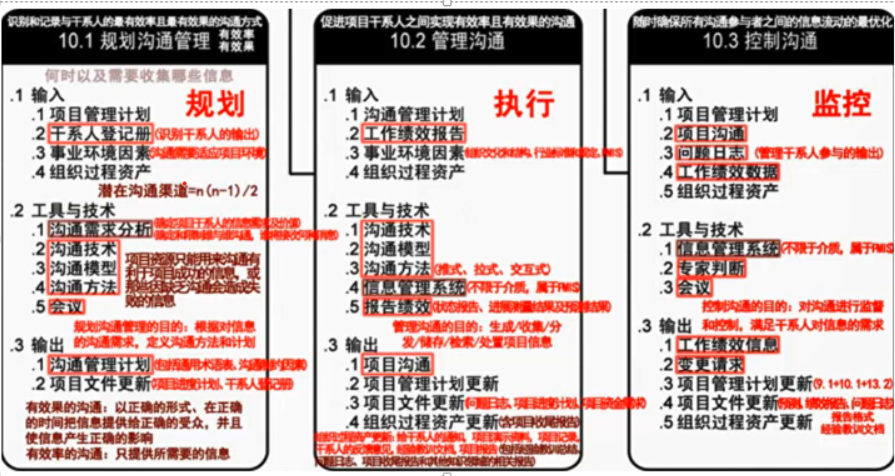
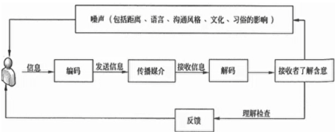
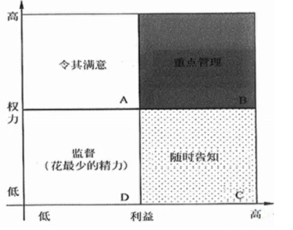
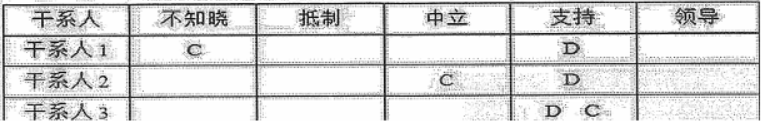

# 沟通管理
分值：3分

## 综合图谱

## 沟通模型

### 5个过程

- **编码**：把想法转换成他人能理解的语言
- **信息和反馈信息**：编码过程得到的结果
- **媒介**：传递信息的方法
- **噪音**：干扰信息传输和理解的因素
- **解码**：把信息还原成有意义的想法

### 5个状态

- **已发送**
- **已收到**
- **已理解**
- **已认可**
- **已转化为积极的行为**

### 沟通的渠道

- 正式渠道：传达文件、召开会议、上下级定期的情报交换
   - 优点：沟通效果好，约束力强，保密
   - 缺点：刻板，沟通速度慢
- 非正式渠道：私下交流、聚会、小道消息
   - 优点：直接明了，速度快，形式多样
   - 缺点：信息不明确，容易曲解，影像团队凝聚力

### 沟通渠道的计算公式
**渠道总量****=n
 * (n - 1) / 2****；****n****为干系人个数**

### 沟通管理计划内容

1. 通用术语表
1. **干系人的沟通需求**
1. **需要沟通的信息，**语言、格式、内容、详细程度等
1. 发布信息的原因
1. 发布信息和做出回应的时限和频率
1. 负责沟通相关信息的人员
1. 负责授权保密信息发布的人员
1. **将要接收信息的个人或小组**
1. **传递信息的技术方法**
1. 为沟通分配的资源，时间和预算等
1. **问题升级程序**，用于规定下层员工上报问题的时限和路径
1. **随项目进展，对沟通管理计划进行更新和优化的方法**
1. 项目信息流向图、工作流程、报告清单、会议计划等
1. 沟通制约因素，例如法律法规、技术要求，组织政策等
1. 关于项目状态会议、团队会议、网络会议和电子邮件等的指南和模板
1. 对项目使用的网站和管理软件的使用说明

## 影响沟通方法选择的因素
**不需要考虑资金因素**

- 信息需求的紧迫性
- 技术的可用性
- 易用性
- 项目环境
- 信息的敏感性和保密性

 

## 沟通方法

- 交互式：两方或多方之间**多向信息交换**。最有效的方法，形式有
   - 会议、电话、即时通信、视频会议
- 推式：把信息发送给接收方，能确定信息的发送，不能确保信息送达和被理解，形式有
   - 信件、备忘录、传真、邮件、日志、新闻
- 拉式：用于**信息量大和受众多，要求接收者自主自行方位信息内容**，形式有
   - 在线课程、经验教训数据库、知识库

## 报告绩效内容
收集和发布绩效信息，包括**状态报告、进展测试结果、预测结果**。

1. 对过去绩效的分析
1. 项目预测分析，时间和成本
1. 风险和问题的当前状态
1. 本报告期完成的工作
1. 下个报告期需要完成的工作
1. 本报告期被批准的变更汇总
1. 需要审查和讨论的其他信息

# 干系人管理

## 综合图谱

## 干系人管理基本内容

- 项目干系人分析
- 沟通管理
- 问题管理

## 干系人登记手册的内容

- 基本信息
- 评估信息
- 干系人分类

## 干系人管理计划的内容

1. 关键干系人的所需参与程度、当前参与程度
1. 干系人变更的范围和影响
1. 干系人之间的关系和潜在关系
1. 项目现阶段的干系人沟通需求
1. 需要分发给干系人的信息
1. 分发相关信息的理由和影响
1. 向干系人发信息的频率和时限
1. 随项目进展，更新和优化干系人管理计划

## 管理干系人的过程活动

1. 调动干系人适时参与项目，用于获得和确认他们对项目成功的**持续承诺**
1. 协商和沟通**管理干系人的期望**、确保项目目标实现
1. 处理尚未成为问题的**干系人关注点**，预测干系人未来可能提出的问题
1. 识别和讨论关注点，**评估项目风险**
1. 澄清和解决已识别出的问题

## 干系人分析（技术）
**识别干系人的利益、期望和影响，并把他们与项目目标联系起来。在项目不同阶段应对干系人施加不同的影响**

### 分析步骤

1. 识别干系人及其相关信息
1. 分析干系人可能的影响，病分类排序
1. 评估干系人对不同情况可能的反应，制定相应策略对他们**施加正面影响**

### 干系人分类模型

- **权利/利益方格**：干系人职权大小和对项目的关注程度

- **权力/影响方格**：干系人职权大小和主动参与程度
- **影响/作用方格**：干系人主动参与程度和改变项目计划/执行的能力
- **凸显模型**：干系人权利、紧迫程度和合法性

### 干系人参与程度分类

- 不知晓
- 抵制
- 中立
- 支持
- 领导

### 干系人参与评估矩阵

- C：现在的分类
- D：将要改变的状态

