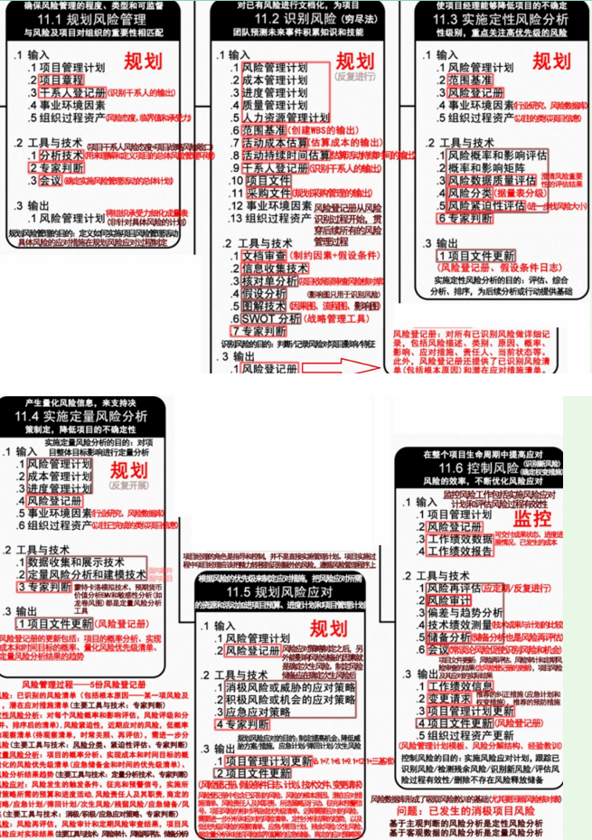

分值：3分

# 综合图谱

# 风险概述

## 基本特性

- 随机性：发生和后果具有偶然性
- 相对性：风险相对于项目活动的主体而言的

## 风险分类

- 按后果分
   - **纯粹风险**
   - **投机风险**
- 按来源分
   - 自然风险
   - 人为风险
- 按可预测性分
   - **已知风险**：发生和后果都可预测
   - **可预测风险**：可以预测发生，不能预测后果
   - **不可预测风险**：有可能发生，可能性不可预见

 

# 风险管理过程

1. **风险管理规划**一决定如何进行规划和实施項目风险管理活动。
1. **风险识别**一判断哪些风险会影响項目，并以书形式记录其特点。
1. **定性风险分析**一对风险概率和影响进行评估和汇总，进而对风险进行排序，以便随后进一步分析或行动
1. **定量风险分析**一一就识别的风险对項目总体目标的影响进行定量分析。
1. **风险应对规划**一针对項目目标制订提高机会、降低威胁的方案和行动。
1. **风险监控**一在整个項目生命周期中，跟踪已识别的风险、监测残余风险、识别新风险和实施风险应对计划，并对其有效性

# 风险管理计划内容

1. 方法论
1. 角色与职责
1. 预算
1. 时间安排
1. 风险类别
1. 风险概率和影响的定义
1. 概率和影响矩阵
1. 修改的项目干系人承受度
1. 报告格式
1. 跟踪

应该**鼓励所有项目人员参与风险的识别**，贯穿全过程；制定风险管理计划首先要考虑**组织及项目人员的风险态度和风险承受度**

# 风险识别的工具技术

- 文档审查
- 信息收集技术
   - **头脑风暴**：集思广益，**不一定有结论，重在听取意见**
   - **德尔菲技术**：**专家匿名**方式进行**若干轮**的意见表达，**一定得出结论**。防止个人对结果造成不适当的过大影响
   - 访谈：主要方法之一
   - **根本原因识别**：对项目风险的根本原因进行调查，制定有效的风险应对假设
- 核对表分析
- **假设分析**：根据一套假定、设想假设进行构思和制订，是检验**假设有效性的一种技术**
- 图解技术
   - 因果图
   - 系统或过程流程图
   - 影响图
- SWOT分析技术
   - 优势strength
   - 劣势weakness
   - 机会opportunity
   - 威胁threat
- 专家判断

# 风险登记册

## 内容

1. 已识别风险清单
1. 潜在应对措施清单
1. 风险根本原因
1. 风险类别更新
1. 更新的风险分类

## 更新哪些部分

1. 项目风险的相对排序和优先级清单
1. 按照类别分类的风险
1. 需要在近期采取应对措施的风险清单
1. 需要进一步分析和应对的风险清单
1. 低优先级风险观察清单
1. 定性分析结果的趋势

 

# 定性风险分析的工具技术
定性风险分析：**对已识别的风险进行优先排序**

- 风险概率与影响评估
- 概率和影响矩阵
   - 高风险：深灰色
   - 中风险：中灰色
   - 低风险：浅灰色

- 风险数据质量评估
- 风险分类
- 风险紧迫性评估
- 专家判断

# 定量风险分析的工具技术

- 数据收集和表示技术
   - 访谈
   - 概率分布
- 定量风险分析和模型技术
   - 敏感性分析
   - 预期货币价值分析
   - 决策树分析

- 模型和模拟（蒙特卡洛技术）

- 专家判断

 

# 规划风险应对的工具技术

- 消极风险或威胁的应对策略

- 积极风险或机会的应对策略

- 应急应对策略
- 专家判断

 

# 控制风险的工具技术

- 风险再评估：不断评估，应对可能出现的新的风险
- 风险审计：检查和记录风险应对措施的有效性，及风险管理过程的有效性
- 偏差和趋势分析
- 技术绩效测量
- 储备分析
- 会议

