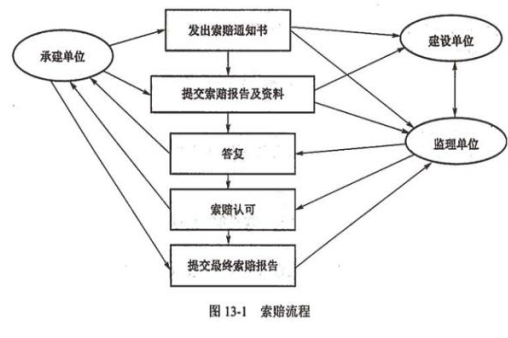

分值：1分

# 合同的分类

- 范围分类：
   - 总承包合同：**有利于发挥卖方的专业优势**
   - 单项承包合同：有利于吸引各多的卖方参与投标竞争，买方可以选择在单项上实力强的卖方
   - 分包合同：5个条件
      - 经过买方认可
      - 分包的部分必须是**项目非主体工作**
      - 只能分包部分项目，**不能转包整个项目**
      - 分包方必须具备相应的资质条件
      - 分包方不能在此分包
- 付款方式：
   - 总价合同：
      - **固定总价合同FFP**：固定不再变了，卖方自己承担盈亏
      - **总价+激励费用合同FPIF**
      - **总价+经济价格调整合同FP-EPA**：持续时间长的合同
   - 成本补偿合同
      - **成本+固定费用合同CPFF**：成本+买方一次性给一笔利润
      - **成本+激励费用合同CPIF**：成本+买方根据目标完成百分比支付利润
      - **成本+奖励费用合同CPAF**：成本+买方凭主观支付一笔利润
   - 工料合同T&M：**计划价格*实际量**，实报实销，激发积极性

##### 从风险类型上来讲：
对买方：风险最小的是固定总价合同（FFP）；风险最大的是成本加固定费用合同（CPFF）。对卖方：风险最小的是成本加固定费用合同（CPFF）；风险最大的是固定总价合同（FFP）。

# 合同类型的选择

- 总价合同
   - 适合工作范围明确，项目的设计以具备详细的细节
   - 卖方承担成本风险
- 成本合同
   - 工作范围不清楚
   - 买方承担成本风险
- 工料合同
   - 适合工作性质清楚、范围不是很清楚，工作不复杂由需要快速签订合同
   - 金额小、工期短、不复杂
   - 双方分担风险
- 单项承包合同：购买标准产品，数量不大

# 合同的内容

1. 项目名称
1. 标的内容和范围
1. 项目的质量要求
1. 项目的计划、进度地点、地域和方式
1. 项目建设过程中的各种期限
1. 技术情报和资料的保密
1. 风险责任承担
1. 技术成果的归属
1. 验收的标准和方法
1. 价款、报酬（或使用费）及其支付方式
1. 违约金或者损失賠偿的计算方法
1. 解决争议的方法
1. 名词术语解释

 

# 合同管理过程

1. 合同签订管理
1. 合同履行管理
1. 合同变更管理
1. 合同档案管理：**整个合同管理的基础**
1. 合同违约索赔管理

# 关于合同一致理解的建议

1. **用国家或行业标准的合同格式。**
1. **对合同标的的描述务必要达到准确、简练、清晰的标准要求，切忌含混不清。**
1. **对于合同中需要变更、转让、解除等内容也应详细说明。**
1. **如果合同有附件，对于附件的内容也应精心准备，并注意保持与主合同一致，不要相互之间产生矛盾**
1. 对于既有投标书，又有正式合同书、附件等包含多项内容的合同，要在条款中列明适用顺序。
1. 保证合同订立的合法性、有效性，当事人可以将签订的合同到公证机关进行公证

# 解决合同争议的方法

- 谈判协商
- 调解
- 仲裁
- 诉讼

# 合同索赔

- 索赔的分类：
   - 工期索赔
   - 费用索赔：经济补偿，非惩罚
- 索赔调解的先后顺序
   - **监理工程师**调解
   - 由**政府建设主管机构**进行调解
   - **经济合同仲裁委员会**调解或仲裁
- 索赔的原则
   - 索赔的有理性
   - 索赔依据的有效性
   - 索赔计算的正确性
- 索赔流程
   - 提出索赔要求
   - 报送索赔资料
   - 监理工程师答复
   - 监理工程师逾期答复后果
   - 持续索赔
   - 仲裁与诉讼（28天）

