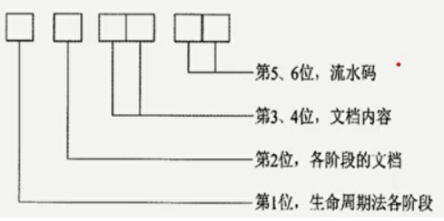
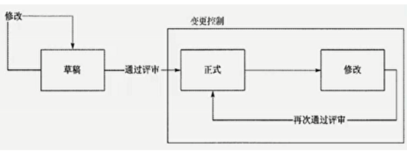
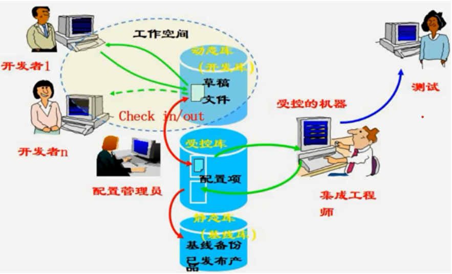

分值：1/2分

# 文档管理

## 软件文档的分类
| 类型 | 作用 | 文档种类 |
| --- | --- | --- |
| 开发文档 | **描述开发过程本身** | 可行性研究报告和项目任务书；需求规格说明；功能规格说明；设计规格说明，包括程序和数据规格说明；开发计划；软件集成和测试计划；质量保证计划；安全和测试信息 |
| 产品文档 | **描述开发过程的产物** | **培训手册；参考手册和用户指南**；软件支持手册；产品手册和信息广告 |
| 管理文档 | **记录项目管理的信息** | 开发过程的每个阶段的进度和进度变更的记录；软件变更情况的记录．**开发团队的职责定义** |

## 文档质量四个等级
| 文档分级 | 适用范围 |
| --- | --- |
| 最低限度文档1级 | 适合**开发工作量低于一个人月**的开发者自用程序包含程序清单、开发记录、测试数据和程序简介 |
| 内部文档2级 | 用于没有与其他用户共享资源的专用程序包含程序清单内足够的注释，帮助用户安装和使用 |
| 工作文档3级 | 适合**同一单位内若干人联合开发的程序**，或可被其他单位使用的程序 |
| 正式文档4级 | 适合**正式发行共普遍使用的软件产品** |

## 文档规范化管理的四个方面和体现

1. 文档书写规范
1. 图标编号规则

3. 文档目录编写标准
3. 文档管理制度

# 配置管理

## 配置管理6个活动

1. 制订配置管理计划
1. 配置标识
1. 配置控制
1. 配置状态报告
1. 配置审计
1. 发布管理和交付

## 配置项

### 典型配置项

- 项目计划书
- 需求文档
- 设计文档
- 源代码
- 可执行代码
- 测试用例
- 运行软件所需的各种数据

**注意**：测试报告、会议纪要、工作记录不是配置项，因为它们一旦形成不再改变

### 配置项分类
配置项的总操作权限由**CMO（配置管理员）**管理

- 基线配置项：设计文档和源程序，开发人员由读取权限
- 非基线配置项：项目的各类计划和报告，PM、CCB等人员开放

### 配置项的状态

- 草稿
- 正式
- 修改

## 配置基线
一个相对稳定的逻辑实体，对基线的变更必须遵循正式的变更控制程序。主要组成：

- 唯一标识号的需求、设计、源代码文卷、可执行代码、构造文卷、用户文档

基线分类：

- 发行基线：交付给外部顾客的基线
- 构造基线：内部开发使用的基线

## 配置库

### 配置库分类

- **开发库**，也称为动态库、程序员库或工作库，用于保存开发人员当前正在开发的配置实体，动态库是开发人员的个人工作区，由开发人员自行控制。库中的信息可能有**较为频繁的修改。（可以任意的修改）**
- **受控库**，也称为主库，包含当前的基线加上对基线的变更。受控库中的配置项被置于完全的配置管理之下。在信息系统开发的某个阶段工作结束时，将当前的工作产品存入受控库。（**可以修改，需要走变更流程**）
- **产品库**，也称为静态库、发行库、软件仓库，包含已发布使用的各种基线的存档，被置于完全的配置管理之下。在开发的信息系统产品完成系统测试之后，作**为最终产品存入产品库内，等待交付用户或现场安装。〈一般不再修改，真要修改的话需要走变更）**

### 建库模式

- 按**配置项类型**建库：适用于通用软件开发
- 按**开发任务**建库：适用于专业软件开发

## 配置管理员CMO职责

1. 编写配置管理计划：配置管理员制定，配置控制委员会审批
1. 建立和维护配置管理系统
1. 建立和维护配置库
1. 配置项识别：基本步骤如下
   1. 识别需要受控的配置项。
   1. 为每个配置项指定唯一性的标识号。
   1. 定义每个配置项的重要特征。
   1. 确定每个配置项的所有者及其责任。
   1. 确定配置项进入配置管理的时间和条件。
   1. 建立和控制基线。
   1. 维护文档和组件的修订与产品版本之间的关系
5. 建立和管理基线
5. 版本管理和配置控制
5. 配置状态报告
5. 配置审计
5. 发布管理和交付
   1. 存储
   1. 复制
   1. 打包
   1. 交付
   1. 重建
10. 对项目成员进行配置管理培训

## 配置管理计划内容

1. 配置管理活动，主要包括配置标识、配置控制、配置状态报告、配置审计、发布管理和交付
1. 实施这些活动的规范和流程
1. 实施这些活动的进度安排
1. 负责实施活动的人员或组织，和它们与其他组织的关系

## 配置状态报告内容

1. 每个受控配置项的标识和状态
1. 每个变更申请的状态和己批准的修改的实施状态。
1. 每个基线的当前和过去版本的状态以及各版本的比较
1. 其他配置管理过程活动的记录。

## 配置审计

### 分类

- 功能配置审计
   - 配置项的开发己圆满完成。
   - 配置项己达到
   - 配置标识中规定的性能和功能特征。
   - 配置项的操作和支持文档己完成并且是符合要求的
- 物理配置审计
   - 要交付的配置项是否存在
   - 配置项中是否包含所有必需的项目

### 配置审计作用

1. 防止向用户提交不适合的产品，如交付了用户手册的不正确版本
1. 发现不完善的实现，如开发出不符合初始规格说明或未按变更请求实施变更
1. 找出各配置项间不匹配或不相容的现象
1. 确认配置项已在所要求的质量控制审核之后纳入基线并入库保存
1. 确认记录和文档报纸可追溯性

