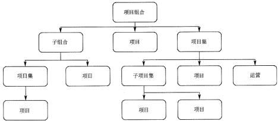
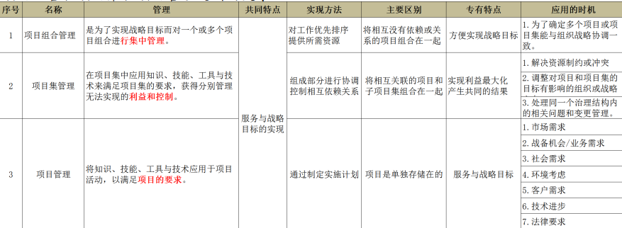
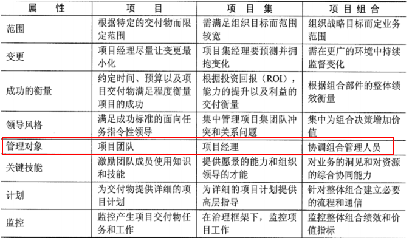
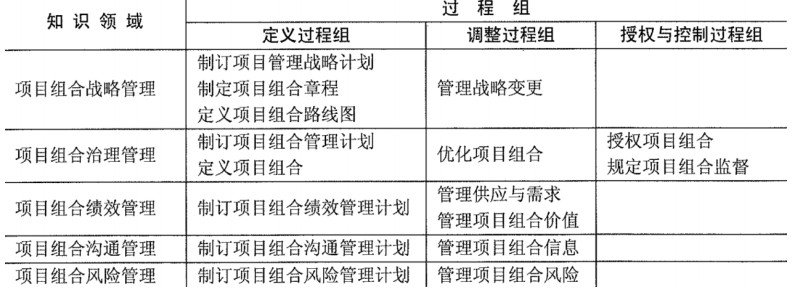
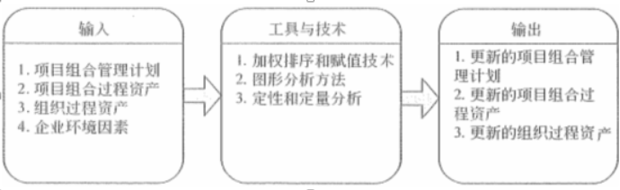

# 项目集，项目组合的关系

- 项目组合：**为实现战略目标而进行的多个项目**
   - 随战略目标的变化而变化
   - 聚焦决策权力
- 项目集：**项目之间存在关联关系，需要统一考虑以实现更大利益**
   - 范围大，提供显著利益聚焦利益，把钱挣到
- 项目：实现组织战略计划的一种手段
   - 明确的目标
   - 聚焦把活干完

# 项目集管理

- 大项目不应该用项目集管理方法来进行管理，而是应该用项目管理方法对其进行管理
- 对多个组件进行组合调整，以便于以优化或整合的成本、进度和工作来实现项目集目标（实现1+1>2的效果）
- 项目集经理用到的5个关联关系（**项目集绩效管理的主要内容**）
   - **项目极战略一致性**
   - **项目集收益管理**
   - **项目集干系人争取**
   - **项目集治理**
   - **项目集生命周期管理**

# 项目集指导委员会主要职责：

- 保证项目集与组织愿景和目标的一致性。
- 项目集批准和启动。
- 项目集筹资

# 项目集治理功能
创建五种支持能力

- 项目集管理办公室：**可是是正式的，或临时抽调的**
- 项目集管理信息系统
- 项目集管理中的知识管理
- 项目集管理审计支持
- 项目集管理教育和培训

# 项目集生命周期
两种划分方法

- 时间顺序：启动、计划、执行、控制、收尾
- 收益的实现情况：
   - **项目集定义阶段**：关键活动如下
      - 建立项目集治理结构
      - 组件初始的项目集组织
      - 制定项目集管理计划
   - **项目集收益支付阶段**：组件不断被规划、监控
   - **项目集收尾阶段**：
      - 项目集移交
      - 项目集关闭

# 项目组合管理

- 项目组合中的部件不见得要相互依赖或者直接相关
- 项目组合包含的组件都需要经过识别、评价、选择以及批准等过程
- 项目组合管理需要**在项目集和项目对资源需求之间的冲突进行平衡，对资源的分配进行合理安排**

## 与项目管理、项目集管理的异同：

# 项目组合计划6个方面

1. 维护项目组合与战略的一致性。
1. 分配财务资源。
1. 分配人力资源。
1. 分配物料或设备资源
1. 度量项目组合中的模块绩效
1. 管理风险

# 项目组合管理实施过程

1. 评估项目组合管理过程的当前状态。
1. 定义项目组合管理的愿景和计划。
1. 实施项目组合管理过程。
1. 改进项目组合管理过程。

# 项目组合管理过程组

# 项目组合风险管理

# 三个关键要素

- 风险计划
- 风险评估
- 风险响应

## 两个子过程

- 制订项目组合风险管理计划：包括识别项目组合的风险、风险责任人、风险承受能力，以及风险管理过程。
- 管理项目组合风险：执行项目组合风险管理计划，包括风险评估、风险响应以及监督风险。

## 四个阶段

1. 风险识别
1. 风险分析
1. 风险响应
1. 风险监控

# 项目组合报告

- 绩效报告
- 治理决策报告
- 项目组合状态报告
- 项目组合趋势报告
- 组织产能报告
- 组织资源使用报告
- 资金/预算报告
- 战略一致性报告

