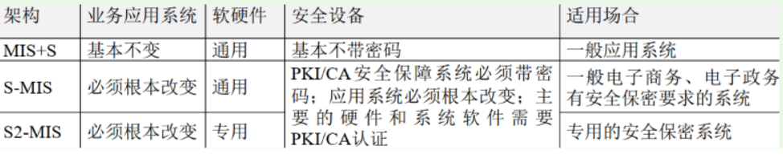

分值：3分

# 安全策略的核心内容（七定）

1. 定方案
1. 定岗
1. 定位
1. 定员
1. 定目标
1. 定制度
1. 定工作流程

# 信息安全（第一章内容）

## 基本要素

- **机密性：**确保信息不暴露给未授权的实体或进程
- **完整性**：得到允许的人可以修改数据，并能判断数据是否被修改
- **可用性**：攻击者占用资源而阻碍授权者工作
- **可控性**：可以控制授权范围内的信息流向和行为方式
- **可审查性**：对出现的网络安全问题听调查的依据和手段

## 安全分类

- 数据安全（即传统的信息安全）
   - 秘密性：信息不被未授权者知晓
   - 完整性：信息是正确、真是、未被篡改，完整无缺的
   - 可用性：信息随时可以正常使用
- 设备安全
   - 稳定性：一定时间内不出故障的概率
   - 可靠性：一定时间内正常执行任务的概率
   - 可用性：设备可以随时正常使用的概率
- 行为安全
   - 秘密性：行为的过程和结果不能危害数据的秘密性
   - 完整性：行为的过程和结果不能危害数据的完整性
   - 可控性：行为出现偏差时，可以被发现和纠正
- 内容安全

## 信息系统安全保护等级

1. 第一级：**个人合法利益**遭到**损害**
1. 第二级：**个人合法利益严重损害**，**社会利益损害**
1. 第三极：**公共利益严重损害，国家安全利益损害**
1. 第四级：**公共利益特别严重损害，国家安全利益严重损害**
1. 第五级：**国家安全利益特别严重损害**

## 系统安全保护能力的五个等级

1. 用户自主保护级：普通内网用户
1. 系统审计保护级：商务活动非重要单位
1. 安全标记保护级：地方各级
1. 结构化保护级：中央级
1. 访问验证保护级：国防关键部门和特殊隔离单位

## 加密算法

## VPN
使用隧道技术

- 点对点隧道协议PPTP
- 第二层隧道协议L2TP
- IP安全协议IPsec

## 入侵检测和入侵防护

- 防火墙：静态安全技术，基于与定义的安全策略
- 入侵检测系统（IDS）：被动，注重网络安全状况的**监管**，发出警报
- 入侵防护系统（IPS）：主动防护，直接嵌入网络流量，有问题的数据吧，会在IPS设备中清除

## Web威胁防护技术

- web访问控制技术
   - 用户名、用户口令识别与验证
- 单点登录：**一点登录，多点访问**
- 网页防篡改技术
   - 时间轮询
   - 核心内嵌
   - 事件触发
   - 文件过滤驱动
- web内容安全
   - 电子邮件过滤
   - 网页过滤
   - 反间谍软件

# 信息安全系统三维空间

- X：安全机制（操作系统，数据库等）
- Y：OSI网络模型
- Z：安全服务（认证，权限，加密等）

# 信息安全保障三种架构

# 访问控制

## 访问控制的两个重要过程

1. 认证过程，**鉴别**主体的合法身份
1. 授权管理，**授权**用户对某项资源的访问权限

## 访问控制方案

1. **DAC自主访问控制方式**：该模型针对每个用户指明能够访问的资源，对于不在指定的资源列表中的对象不允许访问。
1. **ACL访问控制列表方式**：目标资源拥有访问权限列表，指明允许哪些用户访问。如果某个用户不在访问控制列表中，则不允许该用户访问这个资源。
1. **MAC强制访问控制方式**：访问者拥有包含等级列表的许可，其中定义了可以访问哪个级别的目标：例如允许访问秘密级信息，这时，秘密级、限制级和不保密级的信息是允许访问的，但机密和绝密级信息不允许访问。
1. **RBAC基于角色的访问控制方式**：该模型首先定义一些组织内的角色，如局氏、科长、职员；再根据管理规定给这些角色分配相应的权限，最后对组织内的每个人根据具体业务和职位分配一个或多个角色

# 信息安全审计
记录、审查主体对客体进行访问和使用情况，**保证安全规则被正确执行**，并帮助**分析安全事故产生的原因**

## 安全审计系统的作用

1. 对潜在的攻击者起到震慑或警告作用。
1. 对于已经发生的系统破坏行为提供有效的追究证据。
1. 为系统安全管理员提供有价值的系统使用日志，从而帮助系统安全管理员及时发现系统入侵行为或潜在的系统漏洞。
1. 为系统安全管理员提供系统运行的统计日志，使系统安全管理员能够发现系统性能上的不足或需要改进与加强的地方。

## 安全审计的基本类型

- **安全审计数据生成AUJ3EN**：记录与安全相关的事件的出现
- **安全审计浏览AU_SAR**：使授权的用户有效地浏览审计数据
- **安全审计事件选择AU_SEL**：系统管理员能够维护、检查或修改审计事件的集合，能够选择对哪些安全属性进行审计
- **安全审计事件存储AU_STG**：审计系统将提供控制措施；以防止由于资源的不可用丢失审计数据

# 分布式审计系统

- 审计中心
- 审计控制台
- 审计Agent
   - 网络监听型agent
   - 系统嵌入型agent
   - 主动信息获取型agent

