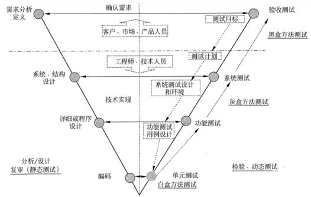
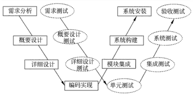
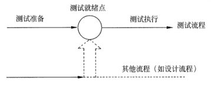
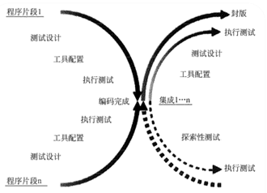
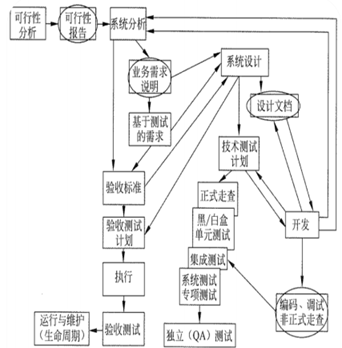
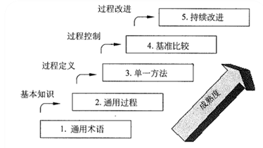

# 软件测试模型
- V模型

- W模型：两个V模型的叠加

- H模型：测试是一个独立的流程，贯穿整个周期

- X模型：针对单独程序片段

- 前置测试模型：测试和开发周期结合

# 性能测试内容

- 负载测试
- 压力测试
   - 并发测试
   - 大数据量测试
- 稳定性测试

# 白盒测试的原则

- 保证一个模块中的所有独立路径至少被测试一次；
- 所有逻辑值均需测真和假两种情况；
- 检查程序的内部数据结构，保证其结构的有效性；
- 在上下边界及可操作范围内运行所有循环

# 项目管理成熟度模型

- Kerzner模型

- 组织级项目管理OPM
- 能力成熟度模型CMMI

# 量化项目管理
量化地管理项目，以达成项目已建立的质量与过程性能目标

## 两个具体目标

- 准备量化管理项目：进行量化管理的准备工作
- 量化的管理项目：使项目得到量化管理

## 起步阶段的度量方案

- 生产率
- 质量
- 规模成本
- 时间

## 度量分类

- 过程度量：战略性目的
- 项目度量：战术性目的
- 技术度量：产品质量

