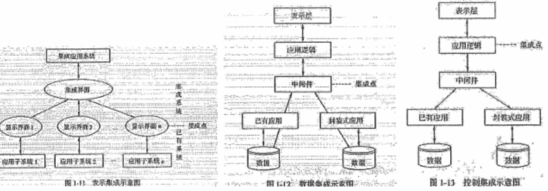

分值：23分

# 本章节涉及到的各种分层：
> - OSI模型7层：**物理层，链路层，网络层，传输层，会话层，表示层，应用层**
> - TCP协议4层：**物理接口层，网络层，传输层，应用层**
> - 网络规划设计的3层：**核心层，汇聚层，接入层**
> - CMMI模型的5层：**初始级，已管理级，已定义级，已量化级，已优化级**
> - 智慧城市的5层：**物联感知层，通信网络层，计算存储层，数据和服务支撑层，智慧应用层**
> - 区块链的6层：**数据层，网络层，共识层，激励层，合约层，应用层**

# 信息系统

## 信息的质量属性包括

- **精确性：**对事物状态描述的准确程度
- **完整性：**对事物状态描述的全面程度，完整信息包括所有重要事实
- **可靠性**：对信息的来源、传递方法、传输过程都是可以信任的，符合预期
- **及时性：**获得信息的时刻与事件发生时刻的间隔长短
- **经济性：**信息获取传输带来的成本在可接受的范围内
- **可验证性：**信息的主要质量属性可以被证实或证伪
- **安全性：**信息可以被非授权访问的可能性

## 信息化的五个层次

1. 产品信息化
1. 企业信息化（生产制造系统、ERP、CRM、SCM）
1. 产业信息化
1. 国民经济信息化
1. 社会生活信息化（智慧城市，互联网金融）

## ERP的特点

1. 专业性产品
1. 供应商项目实施
1. 分布式部署
1. 定位是管理变更

## 国家信息化体系

## 信息系统的生命周期

- 立项
   - 系统规划：输出**可行性研究报告**
- 开发
   - 系统分析：提出**新系统的逻辑模型**
   - 系统设计：设计**新系统的物理模型，**输出**系统设计说明书**
   - 系统实施
   - 系统验收
- 运维和消亡
- 从项目角度，**项目的生命周期**分为：
   - 启动，计划，执行，收尾

# 网络知识

## OSI网络模型与TCP/IP

## IEEE802规范

- **IEEE802.3是重要的局域网协议**
- **IEEE802.11是无线局域网协议（WLAN)**

**

## 网络存储技术

- DAS直接附加存储：本身是硬件的堆叠，存储操作依赖于服务器，没有存储操作系统
- NAS网络附加存储：
   - 即插即用，仅提供文件系统功能
   - 主要是NFS(网络文件系统）和CIFS（通用Internet文件系统）
   - 支持TCP/IP协议，进行小文件级的共享存取
- SAN存储区域网络：
   - 高速光纤，极度可扩展型
   - 采用块block级别存储，没有文件共享存取
   - 再分类：
      - FCSAN：基于光纤通道，热插拔，高速带宽，设备数量大
      - IPSAN：基于IP网络，可共享，成本低，技术简单
      - IBSAN：设计紧密，能缓解各硬件设备之间的数据流量拥塞

## 实现高速以太网的宽带技术
最常用的方式是FTTx+LAN光纤+局域网，分为5种

- FTTC光纤到路边
- FTTZ光纤到小区
- FTTB光纤到楼
- FTTF光纤到楼层
- FTTH光纤到户

## 网络工程三个阶段
网络工程分为三个阶段

- 网络规划
   - **网络需求分析**
   - **可行性分析**
   - **对现有网络的分析和描述**
- 网络设计：分层设计三个关键层
   - **汇聚层**：核心层和接入层的分界面，负责**网络访问策略控制、数据包处理、过滤、寻址，其他数据处理**
   - **核心层**：高速转发通信，提供优化可靠的骨干传输结构
   - **接入层**：允许终端用户连接当网络
- 网络实施

## 网络设计工作包括

- 网络拓扑结构设计
   - 局域网首选**以太网技术**
   - 拓扑结构：考虑地理环境、传输介质与距离、可靠性
      - 总线型、星形、环形，**其中星形最常用**
- 主干网络（核心层）设计：
- 汇聚层和接入层设计：**汇聚层存在与否，取决于网络规模大小**
- 广域网连接与远程访问设计
- 无线网络设计
- 网络安全设计
- 设备选型
   - 核心交换机选型
   - 汇聚层和接入层交换机选型
   - 远程接入和访问设备选型

# 软件开发与测试

## 常用的开发方法

- 结构化方法（生命周期法，瀑布）：**自顶向下、逐步求精、模块化设计**
   - 特点
      - 开发目标清晰化
      - 开发工作阶段化
      - 开发文档规范化
      - 设计方法结构化
   - 不足
      - 开发周期长
      - 不适应需求变化
      - 很少考虑数据结构
- 面向对象方法：系统分析、系统设计和系统实现的界限不明确，自底向上方法
- 原型化方法
   - 分类
      - 水平原型：行为原型，用来**探索预期系统的一些特定行为，并达到细化需求的目的**。用在界面上
      - 垂直原型：结构化原型，主要**用在复杂的算法实现上**
   - 特点
      - 开发周期缩短、成本和风险降低、速度加快，获得较高的综合开发效益
      - 以**用户为中心**来开发，增加了用户的满意度
      - 因为用户参与了系统开发的全过程，**有利于系统的移交，和运行维护**
   - 缺点
      - 适合**分析层面难度大、技术层面难度不大的系统**：对**技术层面难度大的系统，不适合**
- 面向服务
   - 将接口的定义和实现进行解耦
   - 使信息系统快速响应需求和环境变化
   - **提高系统的可复用性、信息资源共享和系统之间的互操作性**

## 中间件
三大层次

- 底层型中间件
- 通用型中间件
- 集成型中间件

为完成不同层次的集成，可采用的技术有：

- 为了完成系统底层传输层的集成，可以采用**CORBA**技术
- 为了完成不同系统的信息传递，可以采用**消息中间件**产品。
- 为了完成不同硬件和操作系统的集成，可以采用**J2EE中间件**产品

## 软件需求分类
软件需求的基本特征：**可验证性**。分类：

- 第一分类方法
   - 业务需求：**反映企业或客户对系统高层次的目标要求**
   - 用户需求：**用户的具体目标**
   - 系统需求：**从系统的角度说明软件需求，**包括
      - 功能需求：系统为用户提供的某项功能，使用户的业务目标得以满足
      - 非功能需求：可维护性、效率、性能等需求
      - 设计约束：限制条件或补充规约
- QFD的分类方法
   - 常规需求
   - 期望需求
   - 意外需求

## SA方法需求分析
建立的模型核心是**数据字典**，分为三个层次的模型

- **数据模型：实体联系图E-R图**
- **功能模型：数据流图DFD**
- **行为模型：状态转换图STD**

## 设计模式
包含**模式名称、问题、目的、解决方案、效果、示例代码和相关设计模式等基本要素**。分类：

- 处理范围不同，分为
   - 类模式：类与子类的关系，**静态关系**
   - 对象模式：对象之间关系，**动态性关系**
- 目的和用途不同，分为
   - 创建型模式：创建对象
   - 结构型模式：处理类或对象的组合
   - 行为型模式：描述类或对象的交互和职责分配

## 软件测试方法

- 静态测试：采用人工检测和计算机辅助静态测试
   - 对文档的测试：检查单checklist方式
   - 代码的测试：
      - **桌前检查**
      - **代码走查**
      - **代码审查**
- 动态测试：白盒和黑盒测试
   - 白盒测试：结构测试，用于单元测试中
      - 控制流测试
      - 数据流测试
      - 程序编译测试
   - 黑盒测试：功能测试，用于集成测试、确认测试和系统测试。使用的方法有
      - 等价类划分
      - 边界值分析
      - 判定表
      - 因果图
      - 状态图
      - 随机测试
      - 猜错法和正交试验法

## 软件测试分类

- 单元测试：模块测试。检查每个模块是否正确实现设计说明中的功能、性能、接口和其他约束条件
- 集成测试：检查模块之间，及模块和已集成的软件之间的接口关系，验证已集成的软件是否符合设计要求
- 确认测试：验证功能、性能等是否符合用户需求
   - **内部确认测试**
   - **Alpha和beta测试：开发环境和用户实际环境测试**
   - **验收测试：以用户为主进行测试**
- 系统测试：真实系统工作环境，验证完整的软件是否满足设计文档和开发合同的要求
- 配置项测试：
- 回归测试**：测试软件变更后，变更部分的正确性和对变更需求的符合性，对原有功能、性能等不损害性**

**

## 通用软件架构分类

- 数据流风格：批处理序列架构，管道/过滤器
- 调用/返回风格：主程序/子程序，数据抽象和面向对象
- 独立构件风格：进程通信和事件驱动
- 虚拟机风格：解释器和基于规则的系统
- 仓库风格：数据库，黑板系统，超文本系统

## 软件架构评估方式

- 调查问卷或检查表
- **基于场景方式：最常见**
   - **分析方法**
      - 架构权衡分析法ATAM
      - 软件架构分析法SAAM
      - 成本效益分析法CBAM
   - 对场景的描述
      - 刺激
      - 环境
      - 响应
- 基于度量

## 评审和审计过程

1. **管理评审**：监控进展，决定计划和进度的状态，确认需求及其系统分配，或评价用于达到目标适应性的管理方法的有效性
1. **技术评审**：评价软件产品，以确定其对使用意图的适合性，表明产品是否满足要求
1. 检查：检测和识别软件产品异常，**正式的**
1. 走查：评价软件产品，走查也可以用于培训软件产品的听众软件，**随意的**
1. **软件审计**：提供软件产品和过程对于可应用的规则、标准、指南、计划和流程的遵从性的独立评价，**审计是事后进行的**

**

# 平均无故障时间公式

- **平均无故障时间（MTTF）**：计算机平均能正常运行多长时间才发生一次故障
- **平均维修时间（MTTR，可维护性）**：故障后维修和重新恢复所花费的时间
- **可用性**：系统正常运行时间的百分比，公式为
   - MTTF / (MTTF+MTTR) * 100%

# 能力成熟度模型CMMI

- CMMI是最著名的**软件过程管理**，分为**阶段式模型和连续式模型**（两种表示方法各有优缺点，都采用统一的24个过程域，对同一组织进行CMMI评估，结果是相同的）
   - 阶段式：表示组织的成熟度
   - 连续式：表示组织的过程能力
   - **24个过程域**分为
      - 过程管理
      - 项目管理
      - 工程
      - 支持
|   | 项目管理 | 过程管理 | 工程 | 支持 |
| --- | --- | --- | --- | --- |
| 组成 | 集成项目管理IPM项目监督与控制PMC项目计划PP量化项目管理QPM需求管理REQM风险管理RSKM供方协议管理SAM | 组织级过程定义OPD组织级过程关注OPF组织级绩效管理OPM组织级过程性能OPP组织级培训OT | 产品集成PI需求开发RD技术解决方案TS确认VAL验证VER | 原因分析与解决CAR配置管理CM决策分析与解决DAR度量与分析MA过程与产品质量保证PPQA |

- **CMMI五层分级**
   - CMMI1初始级：随意混乱，没有稳定的环境
   - CMMI2已管理级：产品和服务满足其规定的过程描述、标准和规程
   - CMMI3已定义级：过程得到清晰的说明和理解
   - CMMI4已量化级：建立了质量与过程性能的量化目标（成熟度3级和4级的关键区别是**对过程性能的可预测性**）
   - CMMI5优化级：组织给予需要的量化理解，不断的改进其进程

# UML

- 面向对象分析阶段的**核心工作是建立系统的用例模型和分析模型**

## UML语言特点

- 一种可视化的建模语言，不是程序设计语言
- 不是过程，也不是方法，但允许任何一种过程和方法使用它
- **最适合迭代式开发过程**

## UML的四种关系

- 依赖：语义关系，一个事物变化会影响另一个事物的语义
- 关联：一组对象之间连接的结构关系
- 泛化：一般化和特殊化的关系
- 实现：类之间的语义关系

## UML的14种图
| **类图** | 描述一组类、接口、协作和它们之间的关系，最常见的图 |  |
| --- | --- | --- |
| **对象图** | 描述一组对象和他们之间的关系，是类图中事物实例的静态快照 |  |
| 构件图 | 一个封装的类和他的接口、端口和内嵌的构件和连接件的内部结构 |  |
| 组合结构图 | 结构化类的内部结构和内部内容 |   |
| **用例图** | 一组用例、参与者和他们之间的关系，包括**基于基本流程的“角色”关系** |  |
| 序列图 | 顺序图，展现一种交互，由一组对象或参与者和他们之间可能发送的消息构成。按**执行者角色、控制类、用户接口、业务层、后台数据库**从左向右排列强调对象的时序 |  |
| 通信图 | 强调收发消息的对象之间组织关系 |  |
| 定时图 | 计时图，关系消息的相对顺序 |  |
| 状态图 | 一个状态机，由状态、转移、事件和活动组成 |  |
| 活动图 | 展示计算内部一步步的控制流和数据流 |  |
| 部署图 | 对运行时的处理节点及在其中生存的构件的配置 |  |
| 制品图 | 描述一个系统的物理结构 |  |
| 包图 | 由模型本身分解而成的组织单元 |  |
| 交互概览图 | 活动图和顺序图的混合物 |   |

## UML的5个系统视图

- 逻辑视图：设计视图，类、子系统、包和用例实现的子集
- 进程视图：逻辑视图的一次执行实例，并发和同步的结构
- 实现视图：文件和构件进行建模
- 部署视图：软件到硬件的映射和分布结构
- 用例视图：**最基本的需求分析模型**

 

## 类之间的关系

- 关联：对象之间的关系
- 依赖：一个类变化引起一个类变化
- 泛化：**继承关系是泛化关系的反关系**
- 聚合：整体和部分的关系，**部分与整体的生命周期不相同**
- 组合：整体与部分的关系，**部分和整体的生命周期相同**
- 实现：接口是实现的关联

# EAI企业应用集成

- 表示集成：界面集成，是最常用的集成，**黑盒集成**
- 数据集成：白盒集成
- 控制集成：功能集成或应用集成，在**业务逻辑层**对应用进行集成
- 业务流程集成：过程集成，由一系列基于标准的、统一数据格式的工作流组成
- 企业之间的应用集成：集成供应链

# 新兴技术

## 云计算分类

- IaaS基础设施即服务：硬件、计算能力、存储空间
- PaaS平台即服务：虚拟的操作系统、数据库管理系统、web应用
- SaaS软件即服务：应用软件、组件、工作流等虚拟化软件

## CPS信息物理系统
CPS是一个综合计算、网络和物理环境的多维复杂系统，通过**3C（computer、communication、control）**，**是智能制造的核心。**

## 智慧城市

### 智能的特点

- 感知能力：获取外部信息的能力
- **记忆和思维能力**：对信息进行分析、计算、比较、判断、联想、决策
- 学习和自适应能力：学习积累知识，使自己能够适应环境变化
- 行动决策能力：对外界的刺激做出反应，形成决策并传达相应的信息

### 智慧城市建设

- 传感器或信息采集设备**获取城市系统数据**
- 通过网络将城市数据分析为**信息**
- 通过**充分共享、智能挖掘**将信息变为知识
- 结合信息技术，将知识应用到各行各业**形成智慧**

### 智慧城市的五个功能层

1. 物联感知层
1. 通信网络层
1. 计算和存储层
1. 数据及服务支撑层
1. 智慧应用层

### 智慧城市三个支撑体系

- 安全保障体系
- 建设和运营管理体系
- 标准规范体系

## 区块链

### 特点

- **分布式存储、点对点传输、共识机制（不同节点建立信息、获取权益的数学算法）、加密算法**

### 分层

- 数据层：底层数据区块、数据加密、时间戳
- 网络层：分布式组网、数据传播机制、数据验证机制
- 共识层：共识算法
- 激励层：经济激励的发行机制和分配机制
- 合约层：各类脚本、算法、智能合约
- 应用层：区块链应用场景

## 商业智能BI

- 内容
   - 数据仓库、联机事务处理OLTP、 联机分析处理OLAP、数据挖掘、数据备份和恢复
- 特点
   - 数据量大、运作复杂、**数据仓库**ETL、数据统计和分析
- 三个层次
   - 数据报表
   - 多维数据分析
   - 数据挖掘

## 数据仓库
用于支持管理决策

- ROLAP：基本数据和聚合数据都放在**RDBMS**中
- MOLAP：基本数据和聚合数据都放在**多维数据库**中
- HOLAP：**基本数据放在RDBMS**，**聚合数据放在多维数据库**

**

## 互联网+特点

1. 跨界融合
1. 创新驱动
1. 重塑结构
1. 尊重人性
1. 开放生态
1. 连接一切

# 工业化和信息化融合的含义

1. 信息化与工业化发展战略的融合
1. 信息资源与材料、能源等工业资源的融合
1. 虚拟经济和工业实体经济的融合
1. 信息技术与工业技术、IT设备与工业装备的融合

# 监理活动

## 四控、三管、一协调
**监理活动的主要内容**

- 四控：
   - 质量控制
   - 进度控制
   - 投资控制
   - 变更控制
- 三管
   - 合同管理
   - 信息管理
   - 安全管理
- 一协调
   - 协调有关单位和人员间的工作关系
- 三个文件
   - 监理大纲
   - 监理规划
   - 监理实施细则

## 总监理工程师任务（**管人、管钱、管工期**）

- 主持编写监理规划
- 签发工程开工/复工报审表、监理通知、工程款支付证书，工程竣工监理报告
- 调节合同争议、处理索赔、审批工程延期
- 监理人员的调配、调换

# 企业系统规划

## 步骤
| 1. 项目确定1. 准备工作1. 定义企业过程1. 识别定义数据类1. 分析现有系统1. 确定管理部门对系统的要求1. 提出判断和结论1. 制定建议书和开发计划1. 成果报告 |  |
| ------------------------------------------------------------ | ------------------------------------------------------------ |

## 信息系统的规划工具

- 制定计划：PERT图、甘特图
- 访谈：调查表、调查提纲
- 确定各层管理人员需求，梳理流程：会谈、正式会议
- 企业组织结构与企业过程的关系，指出过程决策人：**过程/组织矩阵（P/O矩阵）**

- 归纳数据类和企业资源：**资源/数据矩阵（R/D矩阵）**

- 功能法（过程法），利用所识别的企业过程，分析每个过程的输入数据类和输出数据类，与RD矩阵进行比较并调整，最后归纳出系统的数据类：**IPO****（输入****-****处理****-****输出）图**

**

- **过程/数据矩阵（CU矩阵）：**企业过程和数据类定义好后，以企业过程为行，以数据类为列，按照企业过程生成数据类关系填写c (Create)，使用数据类关系填写u(User)

# CRM客户关系管理
要素

- 不仅以**客户为中心**的信息系统，更是一种市场管理策略
- 注重客户满意度，提升企业获得利润的能力
- 要求企业对业务功能重新设计，将业务中心转移到客户，对不同客户采取不同的策略

# 电子政务

- G2G政府对政府
- G2B政府对企业
- G2C政府对公众
- G2E政府对公务员

