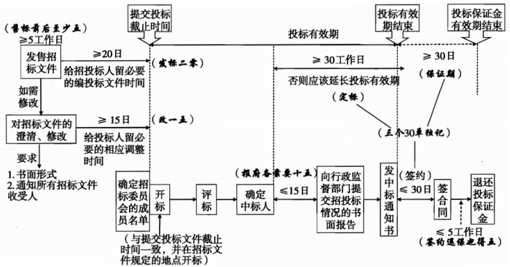

分值：3分

# 合同法

- **要约**：希望和他人订立合同的意思表示，标的明确
- **要约邀请**：希望他人向自己发出要约的意思表示，标的不明确需要讨论
- **承诺**：受要约人同意要约的意思表示
   - 承诺生效的地点为合同成立的地点。采用数据电文形式订立合同的， 收件人的主营业地为合同成立的地点；没有主营业地的，其经常居住地为合同成立的地点
- **格式条款**：打印好的
- **非格式条款**：手写的，发生争议时，按照非格式条款解释

 

# 合同无效（违法合同无效）

1. 一方以欺诈、胁迫的手段订立合同。
1. 恶意串通，损害国家、集体或者第三人利益
1. 以合法形式掩盖非法目的
1. 损害社会公共利益
1. 违反法律、行政法规的强制性规定

 

# 合同内容不明确的规定

1. 质量要求不明确的，按照国家标准、行业标准履行；没有国家标准、行业标准的，按照通常标准或者符合合同目的的特定标准履行。
1. 价款或者报酬不明确的，按照订立合同时履行地的市场价格履行；依法应当执行政府定价或者政府指导价的，按照规定履行。
1. 履行地点不明确，给付货币的，在接受货币一方所在地履行；交付不动产的，在不动产所在地履行；其他标的，在履行义务一方所在地履行。
1. 履行期限不明确的，债务人可以随时履行，债权人也可以随时要求履行，但应当给对方必要的准备时间。
1. 履行方式不明确的，按照有利于实现合同目的的方式履行。
1. 履行费用的负担不明确的，由履行义务一方负担。

#  

# 招投标流程

# 项目分包 项目分包标准

1. 中标项目的部分非主体、非关键性工作分包给他人完成。
1. 接受分包的人应当具备相应的资格条件
1. 不得再次分包。
1. 中标人应当就分包项目向招标人负责，接受分包的人就分包项目承担连带责任
1. 甲方同意

 

# 政府采购法

- 政府采购应当遵循**公开透明原则、公平竞争原则、公正原则和诚实信用原则**
- 政府采购实行集中采购和分散采购相结合
   - 集中采购的范围由省级以上人民政府公布的集中采购目录确定
   - 分散采购：属于地方预算的政府采购项目

 
