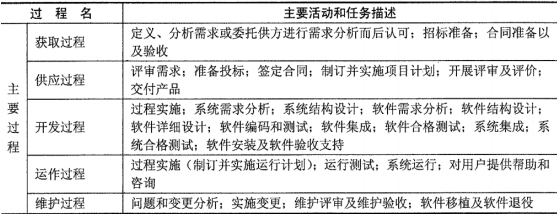
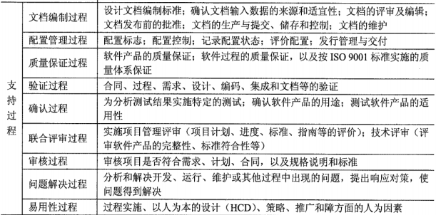
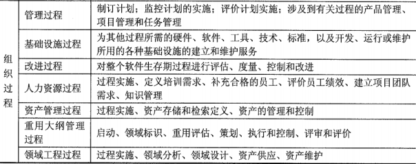
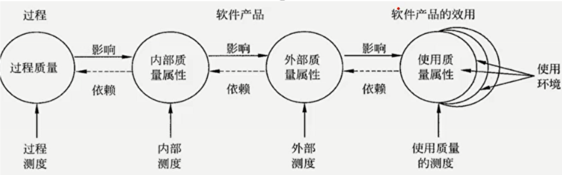
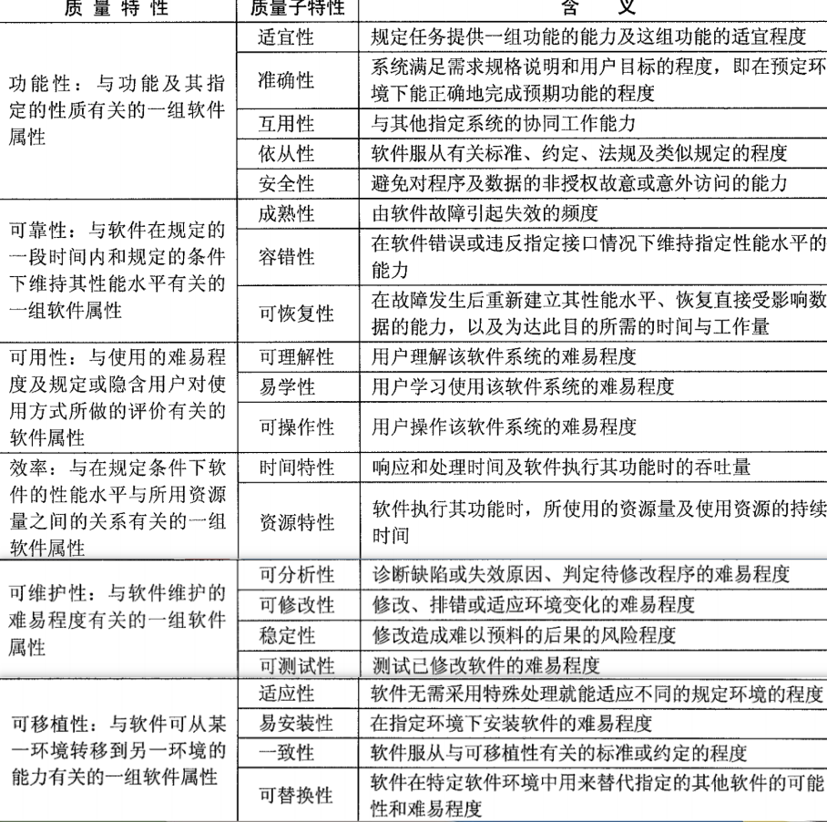

分值：2分

# GB/T11457-2006国家标准中的术语
红色部分为重点

- **审计**：为评估是否符合软件需求、规格说明、基线、标准、过程、指令、代码以及合同和特殊要求而进行的一种独立的检查；
- **代码审计**：由某人、某小组或借助某种工具对源代码进行的独立的审查，以验证其是否符合软件设计文件和程序设计标准。
- **配置审计**：证明所要求的全部配置项均已产生出来，当前的配置与规定的需求相符。
- **认证**：一个系统、部件或计算机程序符合其规定的需求，对操作使用是可接受的一种书面保证。
- **走查**：一种静态分析技术或评审过程，在此过程中，设计者或程序员引导开发组的成员通读已书写的设计或编码，其他成员负责提出问题并对有关技术、风格、可能的错误、是否违背开发标准等方面进行评论
- **鉴定**：一个正式的过程，通过这个过程确定系统或部件是否符合它的规格说明，是否可在目标环境中适合于操作使用。
- **基线**：对于配置管理，有以下三种基线： 
   - 功能基线（最初通过的功能配置）
   - 分配基线（最初通过的分配的配置）
   - 产品基线（最初通过的或有条件地通过的产品配置）
- **配置控制委员会**：对提出的工程上的更动负责进行估价、审批，对核准进行的更动确保其实现的权力机构。
- **配置状态报告**：记录和报告为有效地管理某一配置所需的信息。
- **设计评审**：对现有的或提出的设计所做的正式评估和审查，其目的是找出可能会影响产品、过程或服务工作的适用性和环境方面的设计缺陷并采取补救措施，以及（或者）找出在性能、安全性和经济方面的可能的改进
- **桌面检查**：对程序执行情况进行人工模拟，用逐步检查源代码中有无逻辑或语法错误的办法来检测故障。
- **评价**：决定某产品、项目、活动或服务是否符合它的规定的准则的过程。
- **故障、缺陷**：功能部件不能执行所要求的功能。
- **功能配置审计**：验证一个配置项的实际工作性能是否符合它的需求规格说明的一项审查，以便为软件的设计和编码建立一个基线

# 软件生命周期过程

- 主要过程

- 支持过程

- 组织过程

# 软件产品质量

## 6个质量特性和21个子特性

