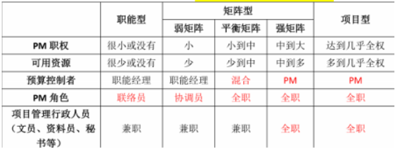

分值：2分

# 5大过程组和具体过程的对应关系
| 十大领域 | 启动 | 规划 | 执行 | 监控 | 结束 |
| --- | --- | --- | --- | --- | --- |
| 整合管理 | 1.制定项目章程 | 2.制定项目管理计划 | 3.指导与管理项目 | 4.监控项目工作    5.实施整体变更控制 | 6.结束项目或阶段 |
| 进度管理 |  | 1.规划进度管理    2.定义活动    3.排列活动顺序    4.估算活动资源    5.估算活动持续时间    6.制定进度管理计划 |  | 7.控制进度 |  |
| 成本管理 |  | 1.规划成本管理    2.估算成本    3.制定预算 |  | 4.控制成本 |  |
| 质量管理 |  | 1.规划质量管理 | 2.实施质量保证 | 3.控制质量 |  |
| 范围管理 |  | 1.规划范围管理    2.收集需求    3.定义范围    4.创建工作分解结构 |  | 5.确认范围    6.控制范围 |  |
| 风险管理 |  | 1.规划风险管理    2.识别风险    3.实施定性风险分析    4.试试定量风险分析    5.定制风险分析 |  | 6.控制风险 |  |
| 沟通管理 |  | 1.规划沟通管理 | 2.管理沟通 | 3.控制沟通 |  |
| 采购管理 |  | 1.规划采购管理 | 2.实施采购 | 3.控制采购 | 4.结束采购 |
| 人力资源管理 |  | 1.规划人力资源管理 | 2.组建项目团队    3.建设项目团队    4.管理项目团队 |  |  |
| 干系人管理 | 1.识别干系人 | 2.规划干系人管理 | 3.管理干系人参与 | 4.控制干系人参与 |  |

 

# 三种主要的组织结构
项目经理的权限**从大到小**依次为：项目型--矩阵型--职能型

## 项目型

## 平衡矩阵型

## 职能型

## 优缺点对比
|   | 简单介绍 | 优点 | 缺点 |
| --- | --- | --- | --- |
| 项目型 | 将所有的能兵强将集结在一起，财务部、业务部、IT管理部等的精英们脱离原有的岗位，形成一个正式的部门，并由项目经理领导。这样的优势是项目经理的权利很强、资源充足。| 1.    项目经理对项目可以负全责2.    项目目标单一，可以以项目为中心、有利于项目顺利进行3.    避免多重领导4.    组织结构简单，交流简单，快速 | 1.    资源不能共享2.    各个独立的项目处于相对封闭状态，不利于公司政策的贯彻3.    对项目组织的成员缺少一种事业上的连续性和安全感4.    项目组织之间处于分割状态，缺少信息交流 |
| 矩阵型 | 兼具项目型和矩阵型的特点；分为**弱矩阵，平衡矩阵，强矩阵**：项目经理>职能经理。强矩阵项目经理=职能经理。平衡矩阵项目经理<职能经理。弱矩阵 | 1.    专职的项目经理负责整个项目，项目为中心2.    公司的多个项目可以共享各个职能部门的资源3.    即利于项目目标的实现，又利于公司目标方针的贯彻4.    项目成员的顾虑减少了 | 1.    容易引起职能经理和项目经理权力的冲突2.    资源共享也能引起项目之间的冲突3.    项目成员有多头领导 |
| 职能型 | 项目经理无权无资源，所有项目人员还在属部门里面供职，仅仅花费小部分的时间来处理项目的事情。还有相应的职能经理，双重管理。 | 1.    可以充分发挥职能部门的资源集中优势2.    部门的专家可以同时为部门内不同项目使用3.    便于相互交流，相互支援，可以随时增派人员4.    可以将项目和本部门的职能工作 | 1.    项目和部门利益发生冲突，职能部门更重视本部门的目标，会忽视项目目标2.    资源平衡会出现问题3.    权利分割不利于各个职能部门的交流和团结协作4.    行政隶属关系使得项目经理没有充分的权利 |

 

# 开发模型

## 螺旋模型
四个阶段

1. 制定计划
1. 风险分析
1. 实施工程
1. 客户评估

一个强调：风险分析 

## 迭代式开发模型
四个阶段

1. 初始：阐述项目范围，选择可行的系统构架，计划和准备业务案例
1. 细化：细化过程和基础设施，选择构件
1. 构造：资源管理、控制和过程最优化
1. 移交：根据完整的构想和需求集的验收标准评估实施基线

# PRINCE2管理方法
**基于流程的结构化**项目管理方法**四要素**：原则，流程，主题，项目环境**七个原则**

1. 持续业务验证
1. 吸取经验教训
1. 明确定义的角色和职责
1. 按阶段管理
1. 例外管理
1. 关注产品
1. 根据项目环境剪裁
