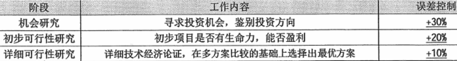

分值：2分

# 项目立项主要活动

1. **提交项目建议书**
1. **项目可行性研究**
1. **项目论证**
1. **项目评估**
1. **项目招标和投标**
1. **签订合同**

# 项目建议书
项目**建设单位**向上级主管部门提交项目申请时的文件，核心内容为：

- 项目的必要性
- 项目的市场预测
- 产品方案或服务的市场预测
- 项目建设必需的条件

 

# 可行性分析

- **技术可行性**考虑因素
   - 进行项目的风险
   - 人力资源的有效性
   - 技术能力的可能性
   - 物资（产品）的可用性
- **经济可行性**
   - 支出分析
   - 收益分析
   - 投资回报分析
   - 敏感性分析

 

## 分析前期的四个阶段

1. 机会研究
1. 初步可行性研究
1. 详细可行性研究
1. 评估与决策

## 初步可行性评估

- 分析项目的前途，从而决定是否继续深入调查研究
- 初步估计和确定项目中的关键技术和核心问题，以确定是否需要解决
- 初步估计必须进行的辅助研究，已解决项目的核心问题，并判断是否具备必要的技术、实验、人力条件作为支持

 

## 详细可行性研究报告的内容

1. 概述
1. 需求确定
1. 现有资源、设施情况分析
1. 设计（初步）技术方案
1. 项目实施进度计划建议
1. 投资估算和资金筹措计划
1. 项目组织、人力资源、技术培训计划
1. 经济和社会效益分析
1. 合作/协作方式

 

# 项目论证

## 三个方面进行调查和分析

1. **市场需求：前提**
1. **开发技术：手段**
1. **财务经济：核心**

## 项目前评价论证的作用

- 项目论证是确定项目是否实施的依据
- 项目论证是筹措资金、向银行贷款的依据
- 项目论证是编制计划、设计、采购、施工以及机构设备、资源配置的依据
- 项目论证是防范风险、提高项目效率的重要保障

## 项目论证的三个阶段

# 项目评估

## 概述
在**可行性研究基础上**，由**第三方（国家、银行、有关机构）**进行评估，最终成果是**项目评估报告**。

## 项目评估的依据

1. **项目建议书及其批准文件**
1. **项目可行性研究报告**
1. **报送单位的申请报告和主管部门的初审意见**
1. **有关资源、配件、燃料、水、电、交通、通信、资金等方面的协议文件**
1. **必须的其他文件和资料**

 

# 开发总成本

- 经营成本
   - 研发成本
   - 行政管理费
   - 销售和分销费用
- 财务费用和折旧

