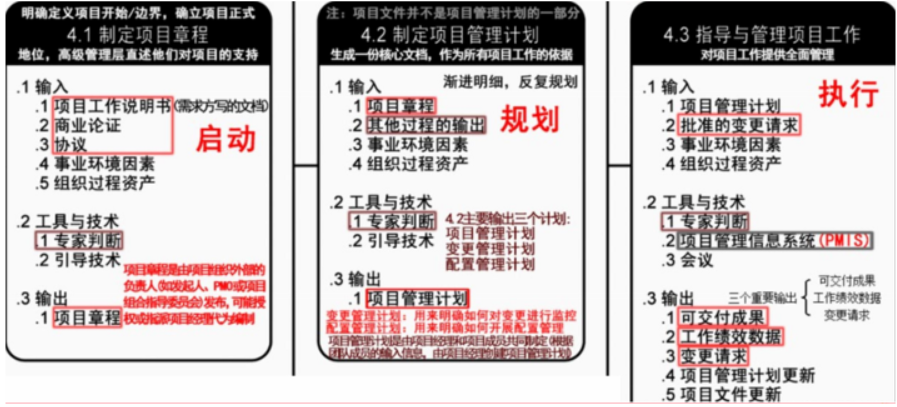
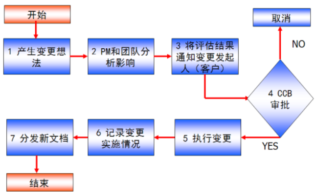

分值：3分

# 综合图谱

# 项目章程

- 由**实施组织外部签发，**不是项目经理
- 内容
   - 项目目的或批准项目的原因
   - 可测量的项目目标和相关的成功标准
   - 项目的总体要求
   - 概括性的项目描述
   - 项目的主要风险
   - 总体里程碑进度计划
   - 总体预算
   - 项目审批要求
   - 委派的项目经理及其职责和职权
   - 发起人或其他批准项目章程的人员的姓名和职权
- **项目章程的批准，标志着项目的正式启动**
- 尽早确认项目经理，项目经理应该参与制定项目章程

# 工作说明书

- 业务需求
- 产品范围说明书
- 战略计划

# 事业环境因素
也叫**企业环境因素，项目经理不可操控和裁剪的，来自组织外部**

- 实施单位的**企业文化和组织机构**
- 国家标准和行业标准
- 现有的设施和固定资产
- 实施单位现有的人力资源、人员的专业和技能、人力资源政策、员工绩效评估和培训记录
- 当时的市场状况
- 项目干系人对风险的承受力
- 行业数据库
- 项目管理信息系统

# 组织过程资产
**项目经理可以控制和裁剪，来自内部**

- 过程和程序
   - 组织的标准过程
   - 标准指导方针、模板、工作指南
   - 标准过程的修正指南
   - 组织的沟通要求，汇报制度
   - 项目收尾指南和要求
   - 财务控制程序
   - 问题和缺陷管理程序
   - 变更控制程序
   - 风险控制程序
   - 标准与发布工作授权程序
- 组织的全部知识
   - 项目档案
   - 过程测量数据库
   - 经验学习系统
   - 问题和缺陷管理数据库
   - 配置管理数据库
   - 财务数据库

# 财务价值评估方法

- 净现值分析
- 投资收益率分析
   - ROI=（总的折现收益 - 总的折现成本）/ 折现成本
- 投资回收期分析

# 项目管理计划内容

1. 项目管理团队选择的各个**项目管理过程**
1. 每一选定过程**实施水平**
1. **使用的工具与技术所作的说明**
1. **选定过程的方式和方法**
1. 为实现项目目标执行**工作的方法、方式**
1. 监控变更的**方式、方法**
1. 实施配置管理的**方式、方法**
1. 实施效果测量基准的**方式、方法**
1. **项目干系人之间的沟通技巧**
1. **选定的项目生命期和多阶段项目的项目阶段**
1. 高层管理人员对**内容、范围和时间安排的关键审查**

# 项目收尾
内容：

- **项目验收**
   - 验收测试
   - 系统试运行
   - 系统的文档验收
      - 系统集成项目介绍
      - 系统集成项目最终报告
      - 信息系统说明手册
      - 信息系统维护手册
      - 软硬件产品说明书、质量保证书
   - 项目终验
- **项目总结**
   - 内容
      - 项目绩效
      - 技术绩效
      - 成本绩效
      - 进度计划绩效
      - 项目的沟通
      - 识别问题和解决问题
      - 意见和建议
   - 意义
      - 了解项目全过程的工作情况和相关团队与成员的绩效状况
      - 了解出现的问题并进行改进措施总结
      - 了解项目全过程中出现的经验教训，进行总结
      - 对总结和文档进行讨论，纳入公司知识库，成为企业的过程资产
- **系统维护**
   - 软件bug修改
   - 软件升级
   - 后续技术支持
   - 日常维护和硬件更新
   - 新需求
- **项目后评价**
   - 目标评价
   - 过程评价
   - 效益评价
   - 可持续性评价

# 变更管理流程

