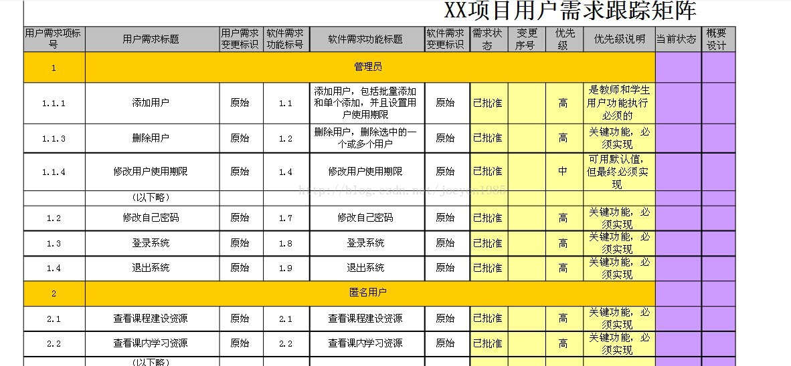

分值：3分

# 综合图谱

# 产品范围和项目范围

- 项目范围
   - 经过批准的**项目范围说明书**
   - **WBS**
   - **WBS词典**
   - 根据**范围基准**来衡量项目范围是否完成
- 产品范围
   - 是项目范围说明书的重要组成部分
   - 根据**产品是否满足产品描述**来判断产品范围是否完成

 

# 范围管理计划内容

1. 如何制定项目范围说明书
1. 如何根据范围说明书创建WBS
1. 如何维护和批准WBS
1. 如何确认和正式验收已完成的项目可交付成果
1. 如何处理项目范围说明书的变更，与实施整体变更控制过程相连

 

# 项目范围说明书的内容

1. 产品范围描述
1. 验收标准
1. 可交付成果
1. 项目的除外责任
1. 制约因素
1. 假设条件

 

# 需求管理计划

- 描述在项目生命周期内**如何分析、记录和管理需求**
- 内容
   - 如何规划、跟踪和汇报各种需求活动
   - 需求管理需要使用的资源
   - 培训计划
   - 项目干系人参与需求管理的策略
   - 判断项目范围与需求不一致的准则和纠正流程
   - 需求跟踪结构
   - 配置管理活动
- 需求的特征
   - 可跟踪性
   - 可验证性：**最基本特性**

 

# 收集需求

## 收集需求的技术和工具

## 收集需求的输出

- 需求文件
   - 业务需求
   - 干系人需求
   - 解决方案需求
   - 项目需求
   - 过度需求
   - 与需求有关的假设条件、依赖关系和制约因素
- 需求跟踪矩阵

 

## 需求跟踪

### 正向反向跟踪

- **正向跟踪**：检查需求文件中的每个需求是否在工作产品中找到对应点
- **反向跟踪**：检查设计文档、产品构件、测试问道等工作成果是否都在需求文档中有出处

### 需求跟踪矩阵
表示**需求和其他产品元素之间的联系链**，将产品需求从其来源链接到能满足需求的可交付成果上

# 创建WBS

## 基本层次划分

- **里程碑**：里程碑标志着某个可交付成果或者阶段的正式完成。重要的检查点是里程碑，重要的里程碑是基线。
- **控制账户**：一种管理控制点。一个控制账户可以有多个工作包，但一个工作包只属于一个控制账户
- **规划包**：控制账户之下、工作包之上的WBS要素。随着情况的逐渐清晰，规划包最终被分解成工作包和相应的具体活动
- **工作包**：建议大小：最少8小时，最多80小时
- **WBS词典**：描述WBS各组成部分的文件

## 项目工作分解成WBS的步骤

1. 识别和分析可交付成果及相关工作
1. 确定WBS的结构和编排方式
1. 自上而下逐层细化分解
1. 为WBS组件制定和分配标识编码
1. 核实可交付成果分解的程度是恰当的

## 创建WBS的划分原则

1. 功能或技术原则，考虑将不同人员的工作分开
1. 组织结构
1. 系统或子系统。总的系统划分为几个子系统，再对每个子系统进行分解
1. 项目生命周期的各阶段作为分解的第二层
1. 产品和可交付成果放在第三层，**主要可交付成果作为第二层**
1. 整合项目团队以外组织来实施的各种组件，作为**外包工作的**一部分。卖方需编制相应的合同WBS

## WBS的表示形式
举例

## WBS分析需要注意的8个方面

1. WBS必须**面向可交付成果**
1. 必须符合项目范围
1. WBS的底层应该支持计划和控制
1. WBS中的元素**有且只有一个人负责**
1. WBS应控制在**4-6层**
1. WBS应包括项目管理工作，和分包出去的工作
1. WBS编制需要**所有（主要）项目干系人和项目团队成员参与**
1. WBS可以随项目进展逐步修改更新

 

# 确认范围
确认范围是**针对项目可交付成果，由客户或发起人在阶段末确认验收的过程**。

## 一般步骤

1. 确定需要进行范围确认的时间
1. 识别范围确认需要哪些投入
1. 确认范围正式被接受的标准和要素
1. 确定范围确认会议的组织步骤
1. 组织范围确认会议

## 范围确认与质量控制和项目收尾的区别
| 范围确认 | 质量控制 | 项目收尾 |
| --- | --- | --- |
| 强调获得客户或发起人的接受 | 强调可交付成果的正确性 | 强调结束项目的流程性工作和验收产品 |
| 在阶段末进行 | 在确认范围前进行，也可同时进行 |   |
| 外部干系人检查验收 | 内部质量部门检查 |   |

 

# 控制范围
监督项目和产品的范围状态、**管理范围基准变更**

## 范围蔓延和范围镀金

- 蔓延：未经控制的范围扩大，客户不断提出新要求
- 镀金：项目实施人员尝试新技术，或自己做主为项目加上的格外功能

## 范围变更控制的主要工作

1. 影响导致范围变更的因素，尽量使这些因素向有利的方向发展
1. 判断范围变更是否已经发生
1. 范围变更发生时管理实际的变更，确保所有被请求的变更按照项目变更控制流程处理
