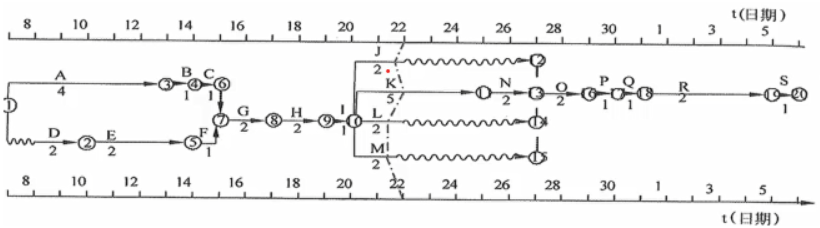
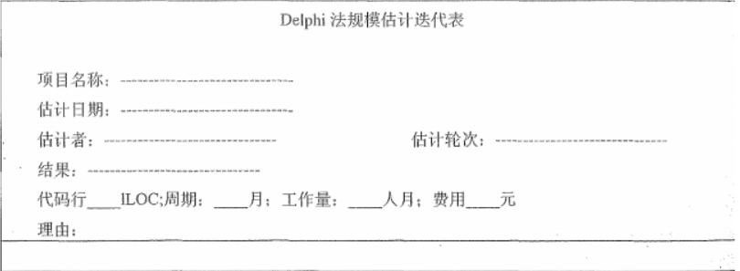
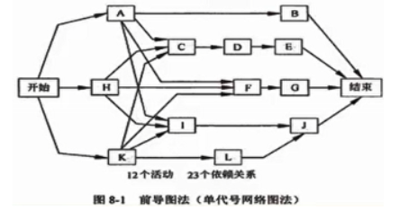
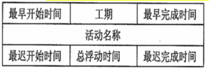
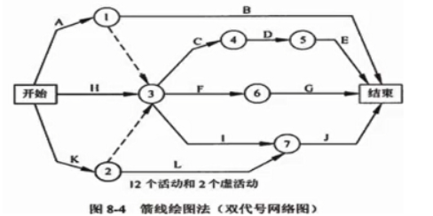
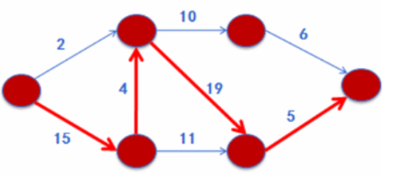
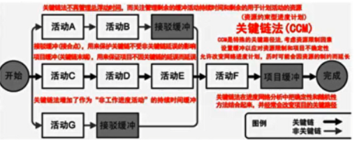

分值：3分

# 综合图谱

# 资源日历

- 表明每种具体资源的**可用工作日和工作班次**的日历

# 排列活动顺序的工具

- 横道图（也叫**甘特图**）
- 里程碑图
- 项目进度网络图
- 时标逻辑图（也叫**时标网络图**）
   - 实线表示活动，实线的水平投影表示活动的持续时间
   - 虚线表示虚活动，不占时间，所以垂直画
   - 波浪线表示活动和紧后活动之间的自由浮动时间

## 确定依赖关系

- **强制性依赖关系**：硬逻辑关系
- **选择性依赖关系：**首选逻辑关系，软逻辑关系
- **外部依赖关系：**项目活动与非项目活动之间的依赖关系
- **内部依赖关系：**项目活动之间的紧前关系

# 活动持续时间估计的方法

- **LOC**：所有可执行的源代码行数
- Delphi法

- **类比估算法**：适合评估一些与历史项目相似的项目，通过新项目与历史项目的比较得到规模估计
   - 等价代码行 = （重新设计百分比+重新编码百分比+重新测试百分比）/ 3 x 已有代码行
- **参数估算法**：基于历史数据和项目参数，使用某种算法来计算成本和工期
- **储备分析**：
   - 应急储备：也叫缓冲时间，与“**已知-未知**”风险相关，可以通过**定量分析**来确定，比如**蒙特卡洛模拟法（随机模拟法）**
   - 管理储备：“**未知-未知**”风险，**不包含在进度基准中，**用来应对项目范围中**不可预见的工作**。管理储备可能需要变更进度基准
- **三点估算（****PERT****）**
   - 乐观时间To
   - 最可能时间Tm
   - 悲观时间Tp
   - 公式：
      - 活动持续时间 =（最乐观时间+4 * 最可能时间+最悲观时间）/ 6
      - 持续时间标准差=（乐观时间-悲观时间）/ 6

# 制定进度计划的方法

## 前导图PDM（单代号网络图）

- 节点表示活动，箭线表示活动之间的关系

- 节点的时间包含：
   - 最早开始时间（ES）
   - 最早完成时间（EF）：EF=ES+工期估算
   - 最迟开始时间（LS）
   - 最迟完成时间（LF）：LF=LS+工期估算
   - 公式：
      - 总浮动时间 =  LS-ES = LF-EF
      - 自由浮动时间= min（后一节点的ES）- EF

## 箭线图（双代号网络图）

- 箭线表示活动，活动之间用节点连接
- 有虚活动（不占时间和资源）

## 关键路径法CPM

- 关键路径是工期最长的路径
- 在网络图中寻找关键路径，**关键路径可能有多条，也在不断变化中**

## 关键链法CCM

- 引入了缓冲和缓冲管理概念
   - **项目缓冲**：放在关键链末端的缓冲
   - **接驳缓冲**：放置在非关键链和关键链的结合点
- CCM重点管理**剩余的缓冲持续时间和剩余的活动连持续时间之间的配置关系**，不关注关键路径的总浮动时间

# 进度控制

## 需要关注的内容

- 判断项目进度的当前状态
- 对引起进度变更的因素加以影响，使其向有利的方向发展
- 判断项目进度是否已经发生变更
- 当变更发生时，按照变更控制流程进行处理

## 分析进度偏差

1. 分析产生进度偏差的工作是否为关键活动
1. 分析进度偏差是否大于总时差
1. 分析进度偏差是否大于自由时差
1. 项目进度计划的调整

## 进度压缩的方法

- **赶工**，投入更多而资源或增加工作时间，**以缩短关键活动的工期**
- **快速跟进**，并行施工，**以缩短关键路径的长度**
- 使用高素质的资源或经验丰富的人员
- 减小活动范围或降低活动要求
- 改进方法或技术，以**提高生产效率**
- 加强质量管理，及时发现问题，减少返工，缩短工期

## 资源平衡和优化

1. **资源平衡往往导致关键路径改变，通常是延长**
1. **资源平滑**不会改变关键路径，完工日期不会延迟，**活动只在其自由浮动时间和总浮动时间内延迟，资源平滑可能无法实现所有资源的优化**
