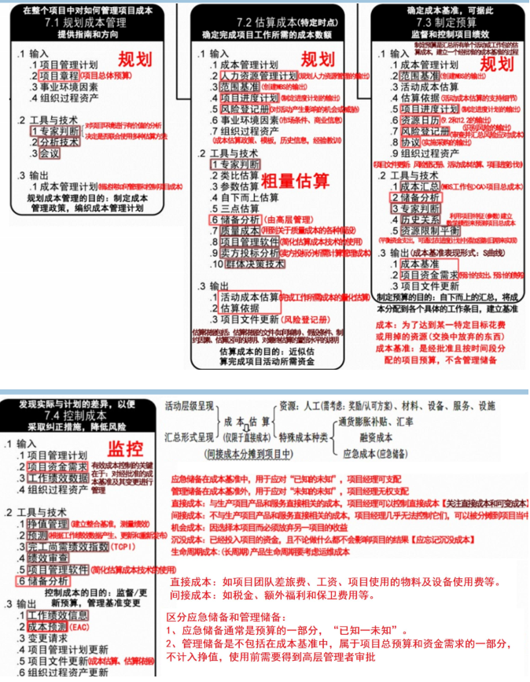
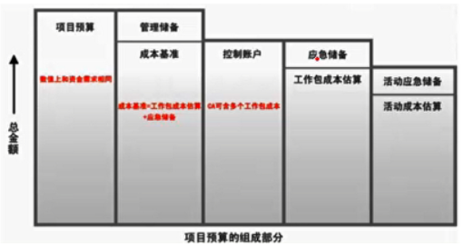
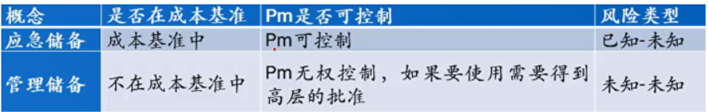

分值：3分

# 综合图谱

#  

# 成本的类型

- **可变成本**：变动成本，随生产量、工作量或时间而变化
- **固定成本**：不变化的非重复成本
- **直接成本**：直接归属项目工作的成本，项目经理可控制
   - 差旅费，工资、设备使用费
- **间接成本**：来自一般管理费用或几个项目共同担负的项目成本
   - 税金、额外福利等
- **机会成本**：泛指一切在做出选择之后其中一个最大的损失
- **沉没成本**：由于过去的决策已经发生的成本，不能由现在或将来的决策改变

# 成本管理计划的内容

1. 计量单位
1. 精确度
1. 准确度
1. 组织程序链接
1. 控制临界值
1. 绩效测量规则
1. 报告格式
1. 过程描述
1. 其他细节

 

# 成本估算的步骤

1. 识别分析成本的构成科目，输出
   1. **资源需求**
   1. **会计科目表**
   1. **项目资源矩阵**
2. 根据已识别的成本构成科目，估算每一科目的成本大小
2. 分析成本估算结果，找出可以相互替代的成本，协调各成本之间的比例关系

 

# 制定成本预算

## 原则

- 项目成本预算要以项目需求为基础。
- 项目成本预算要与项目目标相联系，必须同时考虑项目质量目标和进度目标。
- 项目成本预算要切实可行。
- 项目成本预算应当留有弹性

## 步骤

1. 将项目总成本分摊到项目工作分解结构的各个工作包．分解按照自顶向下，根据占用资源数量多少而设置不同的分解权重
1. 将各个工作包成本再分配到该工作包所包含的各项适动上
1. 确定各项成本预算支出的时间计划及项目成本预算计划

## 成本预算的组成

- 管理储备（**挣值BAC预算的话，不包括此部分**）
- 成本基准
   - 控制账户
      - 应急储备
      - 工作包成本估算
         - 活动应急储备
         - 活动成本储备

## 成本基准
经过**批准的，按时间段分配的项目预算**，只有通过正式的变更程序才能修改

- **应急储备**：包含在成本基准里，使用前不需要得到高层管理者的审批
- **管理储备**：不包含在成本基准里，但**属于项目总预算和资金需求的一部分**，使用前需要得到高层管理者的审批

# 成本控制（工作包为单位）
成本控制是项目管理的重要活动，不只是个人的活动

1. 对造成成本基准变更的因素施加影响·
1. 确保所有变更请求都得到及时处理。
1. 当变更实际发生时，管理这些变更·
1. 确保成本支出不超过批准的资金限额，既不超出按时段、按WBS组件、按活动分配的限额，也不超出项目总限额
1. 监督成本绩效，找出并分析与成本基准间的偏差。
1. 对照资金支出，监督工作绩效。
1. 防止在成本或资源使用报告中出现未经批准的变更。
1. 向有关干系人报告所有经批准的变更及其相关成本。
1. 设法把预期的成本超支控制在可接受的范围内。

 

# 成本分析技术

- 技术分析
   - 回收期，投资回报率，内部报酬率，现金流贴现，净现值
- 专家判断：基于历史信息提供有价值的见解
- 会议
- 类比估算：**粗略的估算方法，成本低，耗时短，准确性低**
- 参数估算：基于参数模型和基础数据的可靠性
- 自下而上估算：准确性取决于工作包的规模和复杂程度
- 三点估算
- 储备分析
- 质量成本COQ
- 项目管理软件
- 卖方投标分析
- 群体决策技术
   - 头脑风暴，德尔菲技术，名义小组

 

# 成本管理技术

- 成本汇总，自下而上汇总，最终得到总成本
- 储备分析
- 历史关系
- 资金限制平衡
- 挣值管理：把范围、进度、资源绩效综合考虑（参考挣值分析计算）
- 完工预测
- 完工尚需绩效指数TCPI
- 绩效审查
- 项目管理软件

