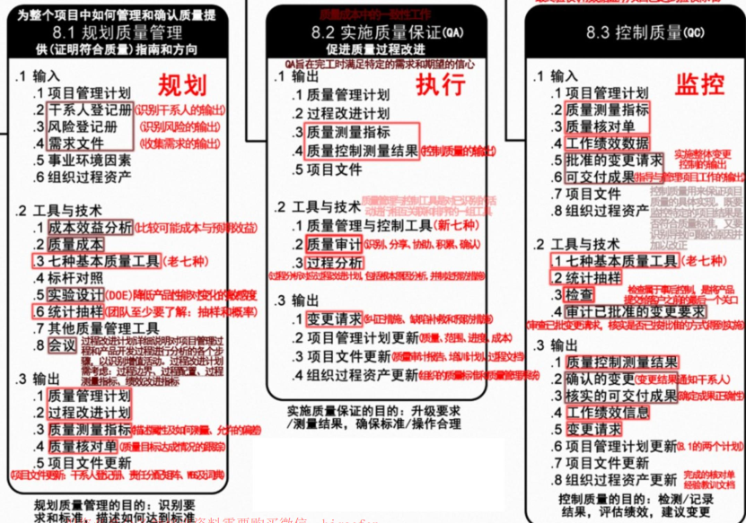
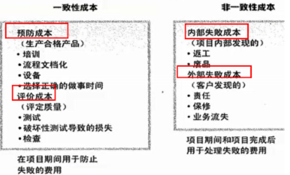
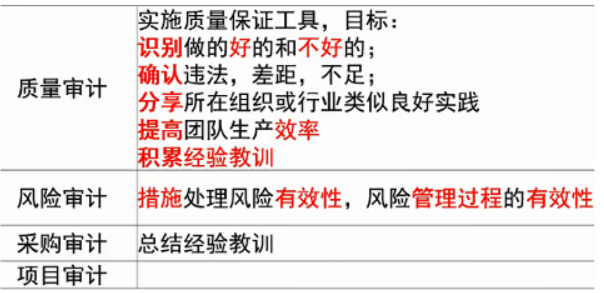
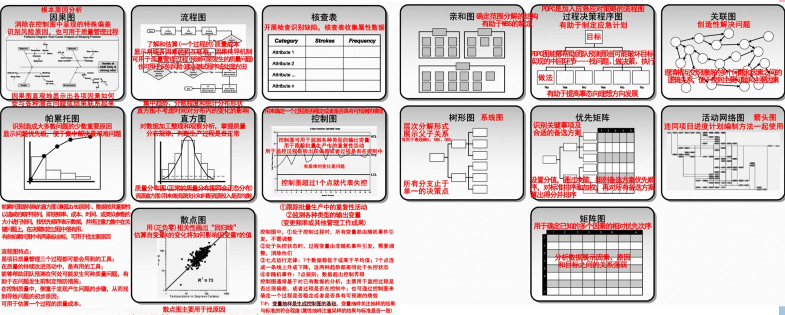

分值：3分

# 综合图谱

# 质量定义

- 国家标准定义**：一组固有特性满足要求的程度**。
- **质量方针**：总方针的一个组成部分，由**最高管理者**批准

## ISO9000质量管理8个基本原则

1. 以顾客为中心
1. 领导作用
1. 全员参与
1. 过程方法
1. 管理的系统方法
1. 持续改进
1. 基于事实的决策方法
1. 与供方互利的关系

## 全面质量管理TQM

- 四个要素
   - 结构，技术，人员，变革推动者
- 四个核心特征
   - 全员参与的质量管理
   - 全过程的质量管理
   - 全面方法的质量管理
   - 全面结果的质量管理

## 六Sigma管理

- **“六倍标准差：**即在质量上每百万不合格率（PPM）少于**3.4**
- 使用**DMAIC改进方法**进行流程改进
   - 确定，测量，分析，改进，控制
- **从项目实施过程中改进和保证质量**，而不是从结果中检验控制质量
- 培养了员工的质量意识，并把这种质量意识融入企业文化中

# 质量管理总过程

1. **规划质量管理：**识别与项目相关的质量标准，确定如何满足这些标准
   1. 质量管理计划可以是正式的，也可以是非正式的；可以非常详细，也可以高度概括。内容如下：
      1. **定义，基本要求，编制流程，实施检查与调整**
2. **实施质量保证：**确保过程质量，建立对未来输出满足特定需求的信心
2. **质量控制**：监督具体实施结果是否符合质量标准，确定消除产品不良结果的原因。作用为：
   1. 识别过程低效或产品质量低劣的原因，建议并采取相应措施消除这些原因
   1. 确认项目的可交付成果及工作满足主要干系人的需求，可以进行最终验收

# 实施质量保证

- 审计质量要求和质量控制测量结果
- 由**质量保证部门和类似的相关部门完成**，项目经理和相关质量部门做好保证工作，质量保证部门进行监督
- 质量保证过程也是为持续过程改进创造条件，不断改进所有过程的质量，消除非增值活动

## 质量保证人员应完成的工作

1. 计划阶段制定质量管理计划和相应得质量标准
1. 按计划实施质量检查，是否按标准过程实施项目工作。注意项目过程中的质量检查，每次进行检查之前准备各检查清单，并将质量管理相关情况予以记录
1. 依据检查的情况和记录，分析问题，发现问題，与当事人协商进行解决。问题解决后要进行验证：如果无法与当事人达成一致，应报告项目经理或更高层领导，直至问题解决；
1. 定期给项目干系人发质量报告
1. 为项目组成员提供质量管理要求方面的培训或指导

 

# 工具和方法

## 质量规划阶段

- **成本收益分析法**：比较每个质量活动的成本和预期收益
- **质量成本法**
   - 列出对生命周期中发生的所有成本，包括为**预防不符合要求、为评价产品或服务是否符合要求，及因为达到要求而发生的所有成本**。
   - 质量保证成本属于一致性成本。

- **标杆对照（基准分析）**：对照计划的项目实践和可比对象，识别最佳实践，形成改进意见，为绩效考核提供依据
- **实验设计**：一种**统计方法**，识别哪些因素会对产品或流程的特定变量产生影响
- 其他工具
   - 头脑风暴，力场分析，名义小组分析

## 质量控制执行阶段

- **质量审计：**又称质量保证体系审核，结构性的评审。
   - 质量审计的目标是：
      1. 识别全部正在实施的良好及最佳实践
      1. 识别全部违规做法、差及不足
      1. 分享所在组织或行业中类似项目的良好实践
      1. 积极、主动地提供协助，以改进过程的执行，从而帮助团队提高生产效率
      1. 强调每次审计都应对织织经验教训的积累做出贡献
   - 审计可以是事先安排， 可以随时进行
   - 由**内部审计师或第三方组织**进行
   - 教材涉及的各种审计的区别

- **过程分析方法**：检查过程运行时遇到的问题和制约因素，识别所需的改进
- **七种基本质量工具（见下一章节）**
- **统计抽样：**从目标总体抽取一部分样本来检查，**可以降低质量控制的成本**
- **检查**：用于确认缺陷补救
   - 审查，同行审查，审计或巡检
- **测试**
- **审查已批准的变更请求**

## 七种基本质量工具

### 老七种工具

- 因果图：鱼骨图，问题陈述放在头部，用来追溯问题来源，回推到可行动的根本原因
- 流程图：有助于了解和估算一个过程的质量成本
- 核查表：计数表，用于收集数据的查对清单
- 帕累托图：排列图，特殊的垂直条形图，用于识别大多数问题的少数重要原因，**二八原理**
- 直方图：用于描述集中趋势、分散程度和统计分布形状
- 控制图：管理图/趋势图，可以判断某一过程处于控制之中还是失控状态
- 散点图：显示两个变量之间是否有关系

### 新七种工具

- 亲和图：针对某个问题，产生可联成有组织的想法模式的各种创意
- 过程决策程序图（PDPC）：用于理解一个目标和步骤之间的关系。有助于**制定应急计划**，预测可能破坏目标实现的中间环节
- 关联图：有助于在包含交叉逻辑关系的复杂情形中**创新性的**解决问题
- 树形图：系统图，用于表现WBS、RBS（资源分解结构）、OBS（组织分解结构）的层次结构
- 优先矩阵：识别关键事项和合适的备选方案，排列方案的优先顺序
- 活动网络图：箭头图
   - AOA活动箭线图
   - AON活动节点图
- 矩阵图

### 图例样式

# 案例分析素材

## 质量管理可能的不足

1. 没有严袼执行公司完善的质量管理体系
1. 没有制定质量管理计划；
1. 没有进行质量保证工作；
1. 前期测试工作不充分。

## 针对不足如何解决

1. 严格执行公司的质量管理体系规范工作流程；
1. 制定质量管理计划：
1. 执行质量保证计划；
1. 调配相关资源（如：人、财、物等）加强后续质量保证工作；
1. 加强后期的质量控制和测试：
1. 提前加强产品交互后的客户服务和维护工作；
1. 加强沟通；
1. 建议必要时修改质量基准争取以最小的代价获得用户认可。

## 软件质量问题产生的原因

1. 管理者缺乏质量观念，未从一开始就强调质量
1. 开发者未将质量作为最重要而且必须完成的任务
1. 没有真正执行“决不把不合袼的中间产品带到下一阶段”的规定；
1. 没有良好的激励机制；
1. 开发人员看不到提高质量对企並生存与发展的重要性，缺乏主人翁责任感
1. 没有解决好质量管理者和开发者的关系；
1. 对用户的质量要求不了解，缺乏使用者满意的思想；
1. 用户对软件需求不清晰，缺乏二义性；
1. 开发人员对用户的需求理解有偏差甚至错误；
1. 质量保证与质量控制的关系不清楚：
1. 开发文档与管理文档对质量控制的作用不大；
1. 软件开发工具引发质量控制困难；
1. 不遵守软件开发标准和规范；
1. 缺乏有效的质量控制和管理

## 如何提升项目质量

1. 强有力的领导；
1. 建立组织级项目管理体系
1. 建立组织级质量管理体系
1. 建立组织级激励制度
1. 理解质量成本
1. 提高项目文档质量
1. 发展和遵从成熟度模型

