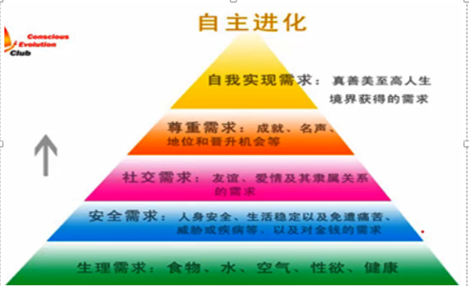
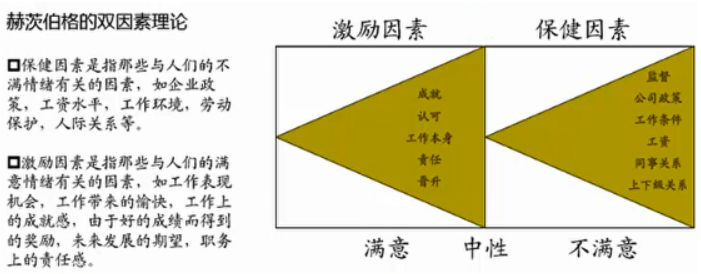
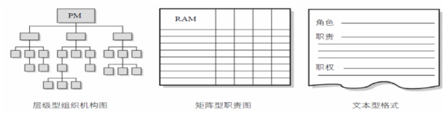
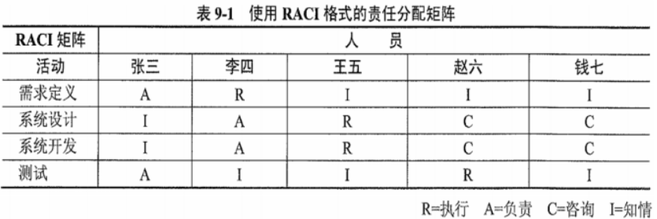

分值：3分

# 综合图谱

# 领导者的三方面工作

1. **确定方向**：为团队设定目标，制定战略
1. **统一思想**：协调人员，团结尽可能多的力量
1. **激励和鼓舞**：领导大家克服困难奋勇前进

项目经理具有领导者和管理者的双重身份。

# 人力资源管理计划的内容

1. **角色与职责**
1. **项目的组织结构图**
1. **人员配备管理计划**：可以是不正式的、不详细的
   1. 人员招募
   1. 资源日历
   1. 人员遣散计划
   1. 培训需要
   1. 认可与奖励
   1. 合规性
   1. 安全

 

# 团队建设的5个阶段
**注意：不管目前是什么阶段，增加一个人或减少一个人，都要从形成阶段重新开始**

1. **形成阶段**：个体转变为团队成员，开始形成共同目标
1. **震荡阶段**：遇到困难，个体之间相互争执、相互指责
1. **规范阶段**：一段时间磨合，成员开始协同工作，相互信任
1. **发挥阶段**：集体荣誉感非常强
1. **解散阶段**：项目结束，团队解散

# 项目经理的5种权利
**项目经理应该注重运用奖励权力、专家权力和参照权力，避免使用惩罚权力**

- 来自组织的职位和授权
   1. 职位权力
   1. 惩罚权力
   1. 奖励权力
- 来自管理者自身
   4. 专家权力：个人的专业技能
   4. 参照权力：成为别人学习参照榜样

# 处理冲突

- **冲突时不可避免的**，项目经理应该**积极的管理冲突**，**直接和合作的方式，私下处理冲突**
- 不管冲突是**正面的还是负面的**，项目经理都有责任处理

## 冲突的特点：

- 冲突是自然地，而且要找到一个解决方法
- 冲突是**一个团队问题**，不是某人的个人问题
- 应公开的处理冲突
- 冲突的解决应聚焦问题，而不是人身攻击
- 冲突的解决应聚焦现在，而不是过去

## 冲突解决的方法：

- 撤退/回避：从实际或潜在冲突中退出，暂时的冲突解决方法
- 缓和/包容：强调一致，淡化分歧
- 妥协/调解：寻找让各方在一定程度上满意的方案
- 强迫/命令：以牺牲其他方为代价，推行某一方的观点
- 合作/解决问题：综合考虑不同意见，采用合作态度和开放式对话达成共识。最理想的结果

# 激励理论

- **马斯洛需求层次理论**
   - **生理需求**：对衣食住行等需求
   - **安全需求**：人身安全、生活稳定、不失业，无疾病等
   - **社会交往需求**：对友谊、爱情和隶属关系的需求
   - **受尊重的需求**：自尊心和荣誉感
   - **自我实现需求**：实现自己的潜力，发挥个人能力

- 赫茨伯格双因素理论
   - 保健因素：不满情绪相关的因素
   - 激励因素：满意情绪相关的因素

- **X理论（人性不好）**
   - 人性好逸恶劳，只要有计划就逃避工作
   - 人生来就以自我为中心，漠视组织的要求。
   - 人缺乏进取心，逃避责任，甘愿听从指挥，安于现状，没有创造性。
   - 人们通常容易受骗，易受人煽动
   - 人们天生反对改革
   - 人的工作动机是为了获得经济报酬
- **Y理论（人性好）**
   - 人天生并不是好逸恶劳，他们热爱工作，从工作得到满足感和成就感。
   - 外来的控制和处罚对人们实现组织的目标不是一个有效的办法，下属能够自我确定目标，自我指挥和自我控制。
   - 在适当的条件下，人们愿意主动承担责任。
   - 大多数人具有一定的想象力和创造力。
   - 在现代社会中，人们的智慧和潜能只是部分地得到了发挥，如果给予机会，人们喜欢工作，并渴望发挥其才能
- 期望理论：人的激励影响因素有两个
   - 目标效价：实现该目标对个人有**多大价值**的主观判断
   - 期望值：实现该目标的**可能性**的主观估计

 

# 项目组织结构图

## 层级型组织结构

- WBS工作分解结构：可交付成果分解成工作包
- OBS组织分解结构：根据部门、单元或团队排列，流出每个部分的工作包
- RBS资源分解结构：按资源类别分解

## RAM责任分配矩阵

- 显示工作包或活动与团队成员之间的关系，**任何任务都只有一个人负责**

# 评价团队有效性的指标

1. 个人技能的改进
1. 团队能力的改进
1. 团队成员离职率的降低
1. 团队凝聚力的加强

