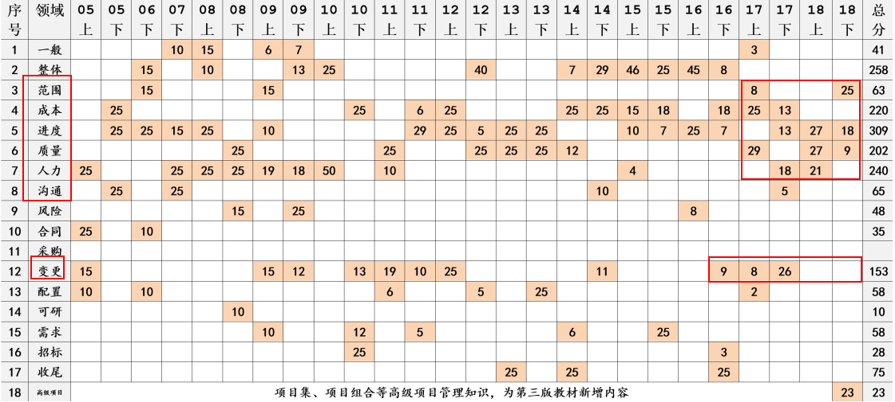

# 主要题型
- 问答题：找错、改错、改进提升
- 计算题
- 分析题
- 理论题
- 填空、选择、判断题
| 题型 | 解答要点 | 题型特点 |
| --- | --- | --- |
| 缺陷型/项目成功 | 分析原因/总结经验教训 | 简答 |
| 措施型 | 写方法、措施、方案应注意：纠正 和
  预防措施 | 简答 |
| 计算型 | 考关键路径计算和挣值计算，也可结合起来考 | 简答+计算 |
| 基础理论型 | 考技术知识，如：组成内容、过程、技术工具 | 填空&选择题&判断题&连线&简答 |

 

# 历年考点分布

# 答题技巧

## 答题顺序

- 先做文字题
- 最后做计算题

## 案例分析五字真言
人机料法环

## 万金油回答要素

- 没有进行可行性研究
- 合同差错
- 没有进行确认、评审
- 风险评估不足
- 项目经理没有经验
- 身兼多职
- 新人加入
- 无质量保证
- 缺乏沟通
- 不重视配置管理
- 无变更流程

 
