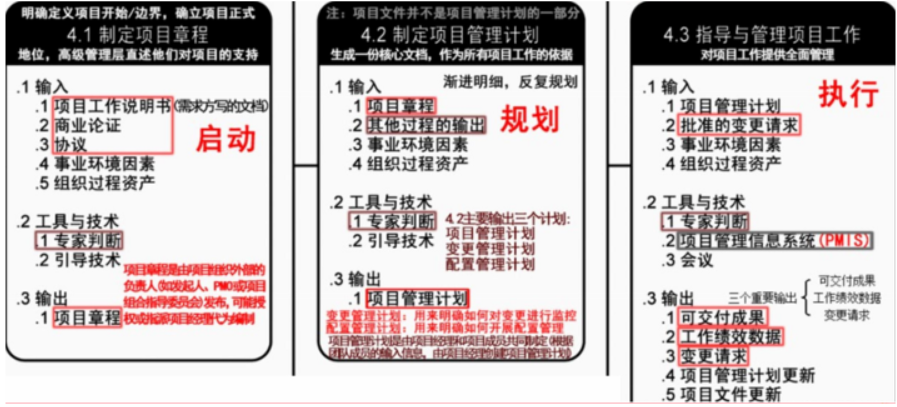

# 一，项目管理一般知识

## 项目关键干系人

1. 项目经理
1. 执行组织
1. 项目团队成员
1. 项目发起人
1. 职能经理
1. 客户
1. 项目管理办公室(PMO)

 

## 项目经理的一般要求

1. 足够的知识
1. 丰富的项目管理经验
1. 良好的协调和沟通能力
1. 良好的职业道德
1. 一定的领导和管理能力

 

## 怎样当好一个项目经理

1. 真正理解项目经理的角色
1. 领导并管理项目团队
1. 依据项目进展的阶段，组织制订详细程度适宜的项目计划，监控计划的执行，根据实际情况、客户要求或其他变更要求对计划的变更进行管理
1. 真正理解“一把手工程”
1. 注重客户和用户参与

 

## 事业环境因素
也叫**企业环境因素，项目经理不可操控和裁剪的，来自组织外部**

- 实施单位的**企业文化和组织机构**
- 国家标准和行业标准
- 现有的设施和固定资产
- 实施单位现有的人力资源、人员的专业和技能、人力资源政策、员工绩效评估和培训记录
- 当时的市场状况
- 项目干系人对风险的承受力
- 行业数据库
- 项目管理信息系统

 

## 组织过程资产
**项目经理可以控制和裁剪，来自内部**

- 过程和程序
   - 组织的标准过程
   - 标准指导方针、模板、工作指南
   - 标准过程的修正指南
   - 组织的沟通要求，汇报制度
   - 项目收尾指南和要求
   - 财务控制程序
   - 问题和缺陷管理程序
   - 变更控制程序
   - 风险控制程序
   - 标准与发布工作授权程序
- 组织的全部知识
   - 项目档案
   - 过程测量数据库
   - 经验学习系统
   - 问题和缺陷管理数据库
   - 配置管理数据库
   - 财务数据库 

 

# 二，立项管理

## 项目立项的内容

1. 提交项目建议书
1. 项目可行性研究
1. 项目招标与投标

 

## 可行性研究内容

1. 投资必要性
1. 技术的可行性
1. 财务可行性
1. 组织可行性
1. 经济可行性
1. 社会可行性
1. 风险因素及对策

## 可行性研究步骤

1. 确定项目规模和目标
1. 研究正在运行的系统
1. 建立新系统的逻辑模型
1. 导出和评价各种方案
1. 推荐可行性方案
1. 编写可行性研究报告
1. 递交可行性研究报告

 

## 投资前期的四个阶段

1. 机会研究
1. 初步可行性研究
1. 详细可行性研究
1. 评估与决策

## 项目建议书的核心内容

1. 项目的必要性
1. 项目的市场预测
1. 产品方案或服务的市场预测
1. 项目建设必需的条件

 

## 承建方项目内部立项的内容

1. 项目资源估算
1. 项目资源分配
1. 准备项目任务书
1. 任命项目经理 

# 三，整体管理

## 活动图谱

## 项目章程的内容

1. 概括性的项目描述和项目产品描述。
1. 项目目的或批准项目的理由，即为什么要做这个项目。
1. 项目的总体要求，包括项目的总体范围和总体质量要求。
1. 可测量的项目目标和相关的成功标准。
1. 项目的主要风险，如项目的主要风险类别。
1. 总体里程碑进度计划。
1. 总体预算。
1. 项目的审批要求，即在项目的规划、执行、监控和收尾过程中，应该由谁来做出哪种批准。
1. 委派的项目经理及其职责和职权。
1. 发起人或其他批准项目章程的人员的姓名和职权

 

## 项目章程的作用

1. 明确项目地位；
1. 项目经理授权；
1. 规定总体目标（范围、时间、成本、质量等）；
1. 项目与战略计划联系起来

 

## 项目管理计划的制定步骤

1. 各具体知识领域制订各自的分项计划。
1. 整体管理知识领域收集各分项计划，整合成项目管理计划。
1. 用项目管理计划指导项目的执行和监控工作，并在执行过程中监控。
1. 对提出的必要的变更请求，报实施整体变更控制过程审批。
1. 根据经批准的变更请求，更新项目管理计划

 

## 项目管理计划的内容

1. 所使用的项目管理过程。
1. 每个特定项目管理过程的实施程度。
1. 完成这些过程的工具和技术的描述。
1. 项目所选用的生命周期及各阶段将采用的过程。
1. 如何用选定的过程来管理具体的项目。包括过程之间的依赖与交互关系和基本的输入和输出。
1. 如何执行工作来完成项目目标及对项目目标的描述。
1. 如何监督和控制变更，明确如何对变更进行监控。
1. 配置管理计划，用来明确如何开展配置管理。
1. 对维护项目绩效基线的完整性的说明。
1. 与项目干系人进行沟通的要求和技术。
1. 为项目选择的生命周期模型。
1. 为解决某些遗留问题和未定的决策，对于其内容、严重程度和紧迫程度进行的关键管理评审。

## 项目管理辅助计划

- 范围管理计划
- 需求管理计划
- 进度管理计划
- 成本管理计划
- 质量管理计划
- 过程改进计划
- 人力资源管理计划
- 沟通管理计划
- 风险管理计划
- 采购管理计划
- 干系人管理计划

 

## 整体变更控制过程

1. 确定是否需要变更或者变更是否已经发生。
1. 对妨碍整体变更控制的因素施加影响，保证只实施经过批准的变更。
1. 审查和批准请求的变更。
1. 控制申请变更的流程，在发生变更时管理批准的变更。
1. 仅允许被批准的变更纳入到项目产品或服务之中，维护基准的完整，并维护项目产品或服务有关的配置与规划文件。
1. 审查与批准所有的纠正与预防措施建议。
1. 根据批准的变更控制与更新范围、成本、预算进度和质量要求，协调整个项目的变更。
1. 将请求的变更的全部影响记录在案。
1. 确认缺陷补救。
1. 根据质量报告并按照标准控制项目质量

## 项目收尾

- 管理收尾
   - 确定管理收尾程序
   - 移交成果
   - 执行程序
   - 经验总结
   - 项目归档
   - 资源遣散
- 合同收尾
   - 产品验收
   - 合同管理收尾

## 变更控制流程

1. 先沟通，书面申请；
1. 评估变更影响（范围，进度，成本，质量等）并将影响通知干系人；
1. CCB按流程审批；
1. 变更审批不通过，则取消变更，纳入监控；变更审批通过则调整和更新项目管理计划和项目文件，并通知干系人；
1. 根据要求执行变更，记录变更实施情况；
1. 验证变更，归档； 

# 四，范围管理

## 活动图谱

## 范围说明书内容

1. 产品范围描述
1. 验收标准
1. 可交付成果
1. 项目的除外责任
1. 制约因素
1. 假设条件

 

## WBS分解的方法

1. 项目生命周期各阶段作为分解的第二层，产品和项目可交付成果放在第三层
1. 主要可交付成果作为分解的第二层
1. 整合可能由项目团队以外的组织来实施的各种组件（例如，外包工作），然后作为外包工作的一部分，卖方需编制相应的合同WBS

## WBS的表示形式

- 分级的树形结构
   - WBS层次清晰，结构性强，但不易修改
   - 不适合大的复杂的项目，适合小项目
- 表格形式
   - 直观性差
   - 能反映项目的所有工作要素，适合大项目

## 项目工作分解成工作包的步骤

1. 识别和分析可交付成果及相关工作
1. 确定WBS的结构和编排方式
1. 自上而下逐层细化分解
1. 为WBS组件制定和分配标识编码
1. 核实可交付成果分解的程度是恰当的

## WBS分析需要注意的8个方面

1. WBS必须**面向可交付成果**
1. 必须符合项目范围
1. WBS的底层应该支持计划和控制
1. WBS中的元素**有且只有一个人负责**
1. WBS应控制在**4-6层**
1. WBS应包括项目管理工作，和分包出去的工作
1. WBS编制需要**所有（主要）项目干系人和项目团队成员参与**
1. WBS可以随项目进展逐步修改更新

## WBS需要把握的原则

1. 在各层次上保持项目的完整性，避免遗漏必要的组成部分。
1. 一个工作单元只能从属于某个上层单元，避免变叉从属。
1. 相同层次的工作单元应有相同性质。
1. 工作单元应能分开不同的责任者和不同工作内容。
1. 便于项目管理进行计划和控制的管理需要。
1. 最低层工作应该具有可比性，是可管理的，可定量检查的。
1. 应包括项目管理工作（因为管理是项目具体工作的一部分），包括分包出去的工作
1. WBS的最低层次的工作单元是工作包。一个项目的WBS是否分解到工作包

## 需求的状态
**进行中、已取消、已推迟、新增加、已批准、已分配、己完成**

# 五，进度管理

## 活动图谱

## 进度管理相关的工具技术

- 估算活动资源
   - **专家判断**
   - **备选方案分析**
   - **发布的估算数据**
   - **项目管理软件**
   - **自下而上估算**
- 估算活动持续时间
   - **专家判断**
   - **类比估算**
   - **参数估算**
   - **三点估算**
   - **群体决策技术**
   - **储备分析**
- 制定进度计划
   - **进度网络分析**
   - **关键路径法**
   - **关键链法**
   - **资源优化技术**
   - **建模技术**
   - **提前量和滞后量**
   - **进度压缩**
   - **进度计划编制工具**
- 进度控制
   - 绩效审查
   - 项目管理软件
   - 资源优化技术
   - 建模技术
   - 提前量和滞后量
   - 进度压缩
   - 进度计划编制工具

## 缩短工期的方法

- **赶工**，投入更多而资源或增加工作时间，**以缩短关键活动的工期**
- **快速跟进**，并行施工，**以缩短关键路径的长度**
- 使用高素质的资源或经验丰富的人员
- 减小活动范围或降低活动要求
- 改进方法或技术，以**提高生产效率**
- 加强质量管理，及时发现问题，减少返工，缩短工期

 

## 监督项目进度的步骤

1. 细化WBS，基于WBS和工时估算制定活动网络图，制定项目工作计划；
1. 建立对项目工作的监督和测量机制；
1. 确定项目里程碑，并建立有效的评审机制；
1. 对项目中发现的问题，及时擦去纠正和预防措施，并进行有效的变更管理；
1. 使用有效的项目管理工具，提升项目管理的工作效率；
1. 通过改进方法和或技术提高生产效率；

# 六，成本管理

## 活动图谱

## 成本管理相关的工具技术

- 成本估算
   - 专家判断
   - 类比估算
   - 参数估算
   - 自下而上估算
   - 三点估算
   - 储备分析
   - 质量成本
   - 项目管理软件
   - 卖方投标分析
   - 群体决策技术
- 成本预算
   - 成本汇总
   - 储备分析
   - 专家判断
   - 历史关系
   - 资源限制平衡
- 成本控制
   - 挣值管理
   - 预测
   - 完工尚需绩效指数（TCPI）
   - 绩效审查
   - 项目管理软件
   - 储备分析

 

## 成本估算的步骤

1. 识别分析成本的构成科目，输出
   1. **资源需求**
   1. **会计科目表**
   1. **项目资源矩阵**
2. 根据已识别的成本构成科目，估算每一科目的成本大小
2. 分析成本估算结果，找出可以相互替代的成本，协调个成本之间的比例关系

 

## 成本预算的原则

- 项目成本预算要以项目需求为基础。
- 项目成本预算要与项目目标相联系，必须同时考虑项目质量目标和进度目标。
- 项目成本预算要切实可行。
- 项目成本预算应当留有弹性

## 成本预算的步骤

1. 将项目总成本分摊到项目工作分解结构的务个工作包．分解按照自顶向下，根据占用资源数量多少而设置不同的分解权重
1. 将各个工作包成本再分配到该工作包所包含的各项适动上
1. 确定各项成本预算支出的时间计划及项目成本预算计划

## 成本控制的内容

1. 对造成成本基准变更的因素施加影响·
1. 确保所有变更请求都得到及时处理。
1. 当变更实际发生时，管理这些变更·
1. 确保成本支出不超过批准的资金限额，既不超出按时段、按WBS组件、按活动分配的限额，也不超出项目总限额
1. 监督成本绩效，找出并分析与成本基准间的偏差。
1. 对照资金支出，监督工作绩效。
1. 防止在成本或资源使用报告中出现未经批准的变更。
1. 向有关干系人报告所有经批准的变更及其相关成本。
1. 设法把预期的成本超支控制在可接受的范围内。

# 七，质量管理

## 活动图谱

## 质量体系建设问题

1. 体系建设应全员参加；
1. 体系应结合企业自身的质量要求和特点，不能照搬其他公司的文件或经验；
1. 体系建设完后应及时运行，不断完善，而不是束之高阁；
1. 在运行过程中，发现问题并进行改进，采用PDCA原则；
1. 质量部门应全员参加质量管理和体系建设及运行；
1. 项目应遵循组织质量体系，在组织的质量体系框架下进行质量管理

## 质量管理过程

   1. 确立质量标准体系；
   1. 对项目实施进行质量控制；
   1. 将实际与标准对照；
   1. 纠偏纠错
-  

## 质量保证的内容

1. 制定质量标准
1. 制定质量控制流程
1. 提出质量保证所采用方法和技术
1. 建立质量保证体系

 

## 质量保证的作用

1. 是保证质量的一个重要环节；
1. 为持续的质量改进提供基础和方法；
1. 为项目干系人提供对质量的信心；
1. 是项目质量管理的一个重要内容；
1. 与质量控制共同构成对质量的跟踪和保证

## 质量保证体系的内容

1. 是否制定明确的质量计划
1. 是否建立健全专职的质量管理机构
1. 是否实现管理业务标准化，管理流程程序化
1. 是否配备必要的资源条件
1. 是否建立了一套灵敏的质量信息反馈系统

## 质量保证
**过程符合要求**，过程改进

1. 按项目计划开展质量活动，使项目过程和产品符合质量要求，即按计划做质量；
1. 提高项目干系人对项目将要满足质量要求的信心；
1. 按过程改进计划进行过程改进，使项目过程稳定并减少非增值环节；
1. 根据过去的质量测量控制结果对质量标准进行重新评价，确保所采用的质量标准上合理的可操作的

 

## 质量控制
**结果符合要求**，纠偏控制

1. 按质量标准检查质量，发现质量偏差和质量缺陷，并对不可接受的质量偏差提出纠偏建议，对质量缺陷提出缺陷补救建议；
1. 对已完成的可交付成果进行质量合格性检查：合格则输出核实的可交付成果，若不合格则提出变更请求；
1. 对批准的变更请求实施情况进行检查：若实施到位则输出确认的变更，反之则输出新的变更请求

 

## 质量保证人员应该完成的工作

1. 计划阶段制定质量管理计划和相应得质量标准
1. 按计划实施质量检查，是否按标准过程实施项目工作。注意项目过程中的质量检查，每次进行检查之前准备各检查清单，并将质量管理相关情况予以记录
1. 依据检查的情况和记录，分析问题，发现问題，与当事人协商进行解决。问题解决后要进行验证：如果无法与当事人达成一致，应报告项目经理或更高层领导，直至问题解决；
1. 定期给项目干系人发质量报告
1. 为项目组成员提供质量管理要求方面的培训或指导

## 过程改进方法

1. 分析目前质量体系（质量管理）的现状；
1. 找出问题及原因；
1. 制定改进计划，确定措施；
1. 确定改进职责，将工作分配到相关部门及人员；
1. 执行改进计划；
1. 对执行的过程及结果进行检查和评估；
1. 进行总结和修改，形成正式质量体系，再不断改进

## 质量控制活动的内容

1. 保证由内部或外部机构进行检测管理的一致性；
1. 发现与质量标准的差异；
1. 消除产品或服务过程中性能不被满足的原因；
1. 审查质量标准以决定可以达到的目标及成本、效率问题，并且需要确定是否可以修订项目的质量标准或项目的具体目标

## 质量成本分类

## 质量7工具

- 老7工具：因果图、流程图、帕累托图、核查表、直方图、控制图、散点图；
- 新7工具：矩阵图、树形图、相互关系图、亲和图、过程决策方法图、活动网络图、优先矩阵

 

## 提升项目质量的步骤

1. 建立项目质量目标；
1. 建立工作中的质量保证和质量控制规范；
1. 建立对质量（过程和产品）参数的度量体系；
1. 在项目中对过程和产品进行测量/检查，将实际情况与目标和规范进行对比以发现质量问题，并对质量问题的处理进行监督和控制；
1. 对质量问题的出现次数和影响程度依次进行分析，找出原因并提出改进措施；
1. 在上述基础上，不断循环，坚持不懈地提升项目质量

 

## 全面质量管理TQM

- 四个要素
   - 结构
   - 技术
   - 人员
   - 变革推动者
- 四个核心特征
   - 全员参与的质量管理
   - 全过程的质量管理
   - 全面方法的质量管理
   - 全面结果的质量管理

 

# 八，人力资源管理

## 活动图谱

## 人力资源管理计划的内容

1. **角色与职责**
1. **项目的组织结构图**
1. **人员配备管理计划**：可以是不正式的、不详细的
   1. 人员招募
   1. 资源日历
   1. 人员遣散计划
   1. 培训需要
   1. 认可与奖励
   1. 合规性
   1. 安全

 

## 成功团队的特点

1. 团队的目标明确，成员清楚自己的工作对目标的贡献。
1. 团队的组织结构清晰，岗位明确。
1. 有成文或习惯的工作流程和方法，而且流程简明有效。
1. 项目经理对团队成员有明确的考核和评价标准，工作结果公正公开、赏罚分明
1. 共同制订并遵守的组织纪律。
1. 协同工作，也就是一个成员工作需要依赖于另一个成员的结果，善于总结和学习

## 人员配备管理计划的内容

1. 人员招募
1. 资源日历
1. 人员遣散计划
1. 培训需求
1. 表彰和奖励
1. 遵守的规定
1. 安全性

 

## 团队建设5个阶段
**注意：不管目前是什么阶段，增加一个人或减少一个人，都要从形成阶段重新开始**

1. **形成阶段**：个体转变为团队成员，开始形成共同目标
1. **震荡阶段**：遇到困难，个体之间相互争执、相互指责
1. **规范阶段**：一段时间磨合，成员开始协同工作，相互信任
1. **发挥阶段**：集体荣誉感非常强
1. **解散阶段**：项目结束，团队解散

## 人力资源相关的工具技术

- 团队建设的工具
   - 人际关系技能
   - 培训
   - 团队建设活动
   - 基本规则
   - 集中办公
   - 认可与奖励
   - 人事测评工具
- 管理团队的工具
   - 观察和交谈
   - 项目绩效评估
   - 问题清单
   - 人际关系技能

 

## 冲突解决的方法

- 撤退/回避：从实际或潜在冲突中退出，暂时的冲突解决方法
- 缓和/包容：强调一致，淡化分歧
- 妥协/调解：寻找让各方在一定程度上满意的方案
- 强迫/命令：以牺牲其他方为代价，推行某一方的观点
- 合作/解决问题：综合考虑不同意见，采用合作态度和开放式对话达成共识。最理想的结果

 

## 冲突的特点

- **冲突是自然地，而且要找到一个解决方法**
- **冲突是一个团队问题，不是某人的个人问题**
- 应公开的处理冲突
- 冲突的解决应聚焦问题，而不是人身攻击
- 冲突的解决应聚焦现在，而不是过去

## 沟通管理图谱

## 沟通管理计划的内容

1. 通用术语表
1. **干系人的沟通需求**
1. **需要沟通的信息，**语言、格式、内容、详细程度等
1. 发布信息的原因
1. 发布信息和做出回应的时限和频率
1. 负责沟通相关信息的人员
1. 负责授权保密信息发布的人员
1. **将要接收信息的个人或小组**
1. **传递信息的技术方法**
1. 为沟通分配的资源，时间和预算等
1. **问题升级程序**，用于规定下层员工上报问题的时限和路径
1. **随项目进展，对沟通管理计划进行更新和优化的方法**
1. 项目信息流向图、工作流程、报告清单、会议计划等
1. 沟通制约因素，例如法律法规、技术要求，组织政策等
1. 关于项目状态会议、团队会议、网络会议和电子邮件等的指南和模板
1. 对项目使用的网站和管理软件的使用说明

 

## 干系人活动图谱

## 干系人登记手册的内容

- 基本信息：干系人的姓名、职位、地点、项目角色、联系方式
- 评估信息：主要需求、主要期望、对项目的潜在影响、与生命周期的哪个阶段最密切相关
- 干系人分类：关键干系人/非关键干系人、内部/外部、支持者/中立者/反对者

## 干系人管理计划的内容

1. 关键干系人的所需参与程度、当前参与程度
1. 干系人变更的范围和影响
1. 干系人之间的关系和潜在关系
1. 项目现阶段的干系人沟通需求
1. 需要分发给干系人的信息
1. 分发相关信息的理由和影响
1. 向干系人发信息的频率和时限
1. 随项目进展，更新和优化干系人管理计划

## 管理干系人的过程活动

1. 调动干系人适时参与项目，用于获得和确认他们对项目成功的**持续承诺**
1. 协商和沟通**管理干系人的期望**、确保项目目标实现
1. 处理尚未成为问题的**干系人关注点**，预测干系人未来可能提出的问题
1. 识别和讨论关注点，**评估项目风险**
1. 澄清和解决已识别出的问题

## 权力利益方格

# 十，合同管理

## 无效合同

1. 一方以欺诈、胁遗的手段订立合同。
1. 恶意串通，损害国家、集体或者第三人利益。
1. 以合法形式掩盖非法目的。
1. 损害社会公共利益。
1. 违反法律、行政法规的强制性规定

 

## 项目费用工程款的支付方式的内容

1. 支付贷款的条件
1. 结算支付的方式
1. 拒付货款的条件。发包方有权部分或全部拒付货款

## 合同法规定的4中违约责任

1. 继续履行
1. 采取补救措施
1. 赔偿损失
1. 支付约定违约金或定金

## 合同管理过程

1. 合同签订管理
1. 合同履行管理
1. 合同变更管理
1. 合同档案管理：**整个合同管理的基础**
1. 合同违约索赔管理

 

## 合同签订的注意事项

1. 当事人的法律资格：民事权力能力
1. 质量验收标准：验收是否合格
1. 验收时间：什么时候验收
1. 技术支持服务：明确技术支持，后续服务
1. 损害赔偿：
1. 保密约定：当事人在订立合同过程中知悉的商业秘密，无论合同是否成立，不得泄露或者不正当地使用
1. 知识产权约定：合同生效后，当事人就质量、价款或者报酬、履行地点等内容没有约定或者约定不明确的，可以协议补充：不能达成补充协议的，按照合同有关条款或者交易习惯确定；
1. 合同附件;法律公证

 

## 变更合同价款的方法

1. 首先确定合同变更量清单，然后确定变更价款。
1. 合同中已有适用于项目变更的价格，按合同已有的价格变更合同价款。
1. 合同中只有类似于项目变更的价格，可以参照类似价格变更合同价款。
1. 合同中没有适用或类似项目变更的价格，由承包人提出适当的变更价格，经监理工程师和业主确认后执行

 

## 索赔流程

- 提出索赔要求
- 报送索赔资料
- 监理工程师答复
- 监理工程师逾期答复后果
- 持续索赔
- 仲裁与诉讼（28天）

## 技术合同的内容

1. 项目名称
1. 标的内容和范围
1. 项目的质量要求
1. 项目的计划、进度地点、地域和方式
1. 项目建设过程中的各种期限
1. 技术情报和资料的保密
1. 风险责任承担
1. 技术成果的归属
1. 验收的标准和方法
1. 价款、报酬（或使用费）及其支付方式
1. 违约金或者损失賠偿的计算方法
1. 解决争议的方法
1. 名词术语解释

 

# 十一，配置管理

## 配置管理6个活动

1. 制订配置管理计划
1. 配置标识
1. 配置控制
1. 配置状态报告
1. 配置审计
1. 发布管理和交付

## 配置管理计划内容

1. 配置管理活动，主要包括配置标识、配置控制、配置状态报告、配置审计、发布管理和交付
1. 实施这些活动的规范和流程
1. 实施这些活动的进度安排
1. 负责实施活动的人员或组织，和它们与其他组织的关系

## 配置识别的内容

1. 识别需要受控的配置项；
1. 为每个配置项指定唯一性的标识号；
1. 定义每个配置项的重要特征；
1. 确定每个配置项的所有者及其责任；
1. 确定配置项进入配置管理的时间和条件；
1. 建立和控制基线；
1. 维护文档和组件的修订与产品版本之间的关系

 

## 建立基线的好处

1. 基线为开发工作提供了一个定点和快照。
1. 新项目可以在基线提供的定点上建立。新项目作为一个单独分支，将与随后对原始项目（在主要分支上）所进行的变更进行隔离。
1. 当认为更新不稳定或不可信时，基线为团队提供一种取消变更的方法。
1. 可以利用基线重新建立基于某个特定发布版本的配置，以重现己报告的错误

## 配置库分类

- 开发库
- 受控库
- 产品库

 

## 建库的两种模式

- 按**配置项类型**建库：适用于通用软件开发
- 按**开发任务**建库：适用于专业软件开发

 

## 配置库的主要作用

1. 记录与配置相关的所有信息，其中存放受控的软件配置项是很重要的内容。
1. 利用库中的信息可评价变更的后果，这对变更控制有着重要的意义。
1. 从库中可提取各种配置管理过程的管理信息，可利用库中的信息查询回答许多配置管理的问题

## 配置审计作用

1. 防止向用户提交不适合的产品，如交付了用户手册的不正确版本
1. 发现不完善的实现，如开发出不符合初始规格说明或未按变更请求实施变更
1. 找出各配置项间不匹配或不相容的现象
1. 确认配置项已在所要求的质量控制审核之后纳入基线并入库保存
1. 确认记录和文档报纸可追溯性

# 十二，变更管理

## 变更的流程

1. **提出与接受变更申请**
1. **对变更的初审**
1. **变更方案论证**
1. **项目管理委员会审查**
1. **发出变更通知并组织实施**
1. **变更实施的监控**
1. **变更效果的评估**
1. **判断发生变更后的项目是否已纳入正常轨道**

## 项目经理在变更中的作用

- 响应变更提出者的需求，评估变更对项目的影响及应对方案，将需求由技术要求转化为资源需求，供授权人决策
- 据评审结果实施即调整基准。确保项目基准反映项目实施情况

 

## 变更可能存在的问题

1. 没有设置变更影响分析环节
1. 没有建立变更控制委员会来审核变更
1. 所有变更都必须走变更流程，而不是影响不大的就直接修改
1. 由变更控制委员会审核变更请求，而不是项目经理
1. 对变更没有进行记录
1. 缺少对变更实施过程的有效监控
1. 变更结束后要通知相关受影响人员，而不仅仅只项目经理确认
1. 项目变更后投有通知相关干系人存在问题。
1. 没有做好配置管理和版本管理
1. 变更没有产生相关的变更文档

# 十三，风险管理

## 活动图谱

## 可能遇到的风险

1. 需求风险
1. 技术风险
1. 政策风险，法律法规风险；
1. 市场风险
1. 运行风险
1. 团队风险；关键人员风险
1. 预算风险；
1. 范围，成本，质量等其它风险

## 风险管理计划内容

1. 方法论
1. 角色与职责
1. 预算
1. 时间安排
1. 风险类别
1. 风险概率和影响的定义
1. 概率和影响矩阵
1. 修改的项目干系人承受度
1. 报告格式
1. 跟踪

## 风险应对措施

- 消极风险和威胁： 规避、转移、减轻、接受
- 积极风险和威胁：开拓、提高、分享、接受

## 权变措施/应急计划/弹回计划

- 权变措施：未事先计划，控制风险推荐的纠正措施，非工具与技术，未识别的风险发生时，或计划应对均失效时使用，可能用管理储备；
- 应急计划：事先计划的，规划风险应对工具中使用，风险有充分预警信号，预定条件发生时，用应急储备；
- 弹回计划：事先计划的，规划风险应对工具中使用，主要应对计划失效时的后备计划，用应急储备

## 风险登记册的内容

1. 已识别风险清单
1. 潜在应对措施清单
1. 风险根本原因
1. 风险类别更新
1. 更新的风险分类

 

# 十四，收尾管理

## 项目收尾的内容

- **项目验收**
   - 验收测试
   - 系统试运行
   - 系统的文档验收
      - 系统集成项目介绍
      - 系统集成项目最终报告
      - 信息系统说明手册
      - 信息系统维护手册
      - 软硬件产品说明书、质量保证书
   - 项目终验
- **项目总结**
   - 内容
      - 项目绩效
      - 技术绩效
      - 成本绩效
      - 进度计划绩效
      - 项目的沟通
      - 识别问题和解决问题
      - 意见和建议
   - 意义
      - 了解项目全过程的工作情况和相关团队与成员的绩效状况
      - 了解出现的问题病进行改进措施总结
      - 了解项目全过程中出现的经验教训，进行总结
      - 对总结侯文娟进行讨论，纳入公司知识库，成为企业的过程资产
- **系统维护**
   - 软件bug修改
   - 软件升级
   - 后续技术支持
   - 系统日常维护
   - 硬件产品更新
   - 新需求
- **项目后评价**
   - 目标评价
   - 过程评价
   - 效益评价
   - 可持续性评价

# 十五，采购管理图谱

