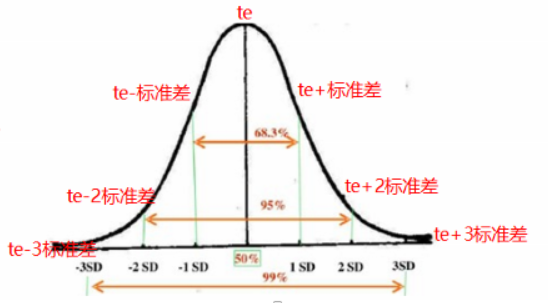
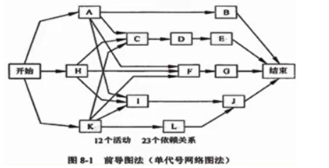
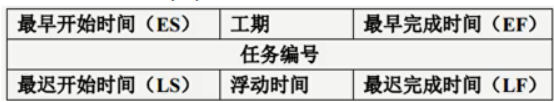
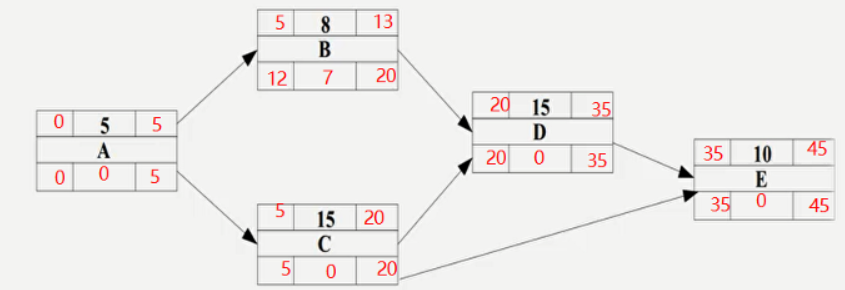
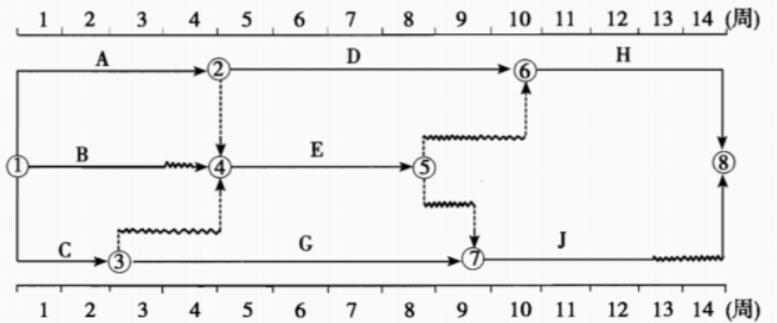
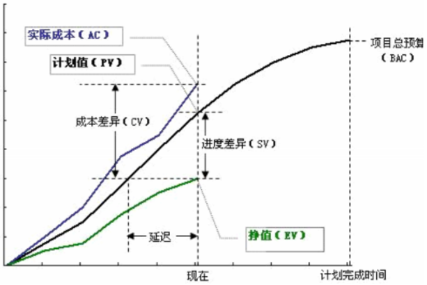
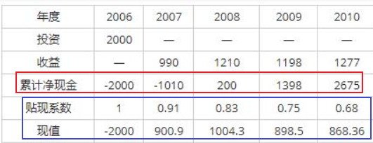
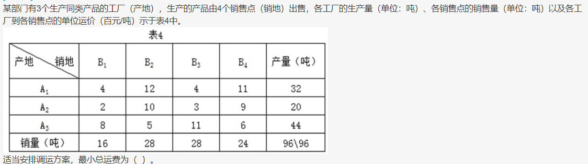
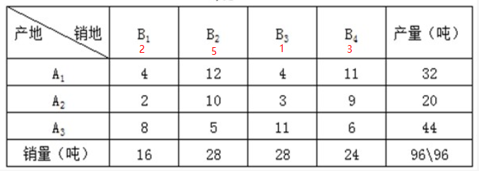
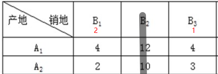

# 进度类计算

## 三点估算PERT

- 最可能时间tm
- 最乐观时间to
- 最悲观时间tp

### 公式

- 活动持续时间**/期望值te=(to+tm*4+tp)/6**
- 持续时间**标准差=(tp-to) / 6**
- **完工概率**：面积法
   - 期望值te为下图的中轴
   - 两边对称分布，分别加减标准差，右加左减，得出天数
   - 图中68%，95%，99%为概率。根据天数和概率即可得到某时间段的完工概率

##  

## 单代号网络图

### 工期计算
节点表示活动，箭线表示活动之间的关系

- 最早开始时间（ES）
- 最早完成时间（EF）：EF=ES+工期估算
- 最迟开始时间（LS）
- 最迟完成时间（LF）：LF=LS+工期估算

- ES和EF：
   - **第一个节点的ES为0**，然后依次往后计算（正推法）
   - 遇到两个节点会合到一个节点的，**取EF的最大值**
- LS和LF：
   - 最后一个节点的EF=LF，然后从后往前推（逆推法）
   - 遇到两个节点会合到一个节点的，**取LS的最小值**
- **浮动时间****/****总时差****      = LS-ES = LF-EF**

注意：关键路径上的浮动时间为0，肯定的

- **自由浮动时间****/****自由时差****=       min(****后一节点的****ES)- EF**
- **关键路径：从开始到结束的路径中，****活动历时之和最大的路径**
- **总工期****：关键路径的历时之和**

### 规律总结
不画上面的网络图，直接根据规律计算，与上面填图的原理是一样的。规律如下

1. 从起点到终点最大长度为关键路径，**关键路径上活动之和为总工期**，关键路径上活动为关键活动
1. **关键路径上活动总时差=自由时差=0**
1. **非关键路径上活动总时差**=**关键路径长度-经过这个节点最大非关键路径长度**
1. **非关键路径上活动自由时差**
   1. 紧后工作是关键工作，总时差=自由时差，总时差计算方法看3
   1. 紧后工作不是关键工作，自由时差=0
   1. 紧后工作有关键工作和非关键工作，自由时差=0

## 双代号网络图规律总结

- **关键路径**：**全实线**组成的路径
- 关键路径上的活动的自由时差=总时差=0
- 某活动的**自由时差=本任务到下一节点的波形线的长度**
- 某活动的**总时差=以该任务为起点，到达重点的路径中波形线之和的最小值**
- 某活动拖延时间对项目进度的影响
   - 非关键活动：如果拖延时间大于总时差，则影响为两者差值
   - 关键活动：该节点关键路径长度变化，重新选择关键路径，比较新旧关键路径的差值 

# 成本类计算

## 挣值分析计算

### 四个参数

- **BAC**：全部计划工作的价值，成本基准
- **计划成本PV**：预算值，**按计划到目前为止应该花费的预算（要干的活）**
- **挣值EV**：到目前为止，完成的工作按计划应该花费的预算**（干完的活）**
   - **EV = PV * 百分比**
- **实际成本AC**：到目前为止，完成的工作实际的花费**（实际花费）**

### 四个指标

- **SV进度偏差**：SV=EV-PV
- **CV成本偏差**：CV=EV-AC
- **进度执行指数SPI**：SPI=EV/PV
- **成本执行指数CPI**：CPI=EV/AC

### 完工预算公式

- **完成尚需估算ETC：**
   - **非典型偏差计算：****ETC=BAC-****截至目前累加****EV**
   - **典型的偏差计算：****ETC=****（****BAC-****截至目前累加****EV****）****/ ****累加****CPI**
- **完成时估算EAC：**
   - **非典型和典型通用：****EAC=AC+ETC**
   - **典型：****EAC=BAC/CPI**
- **完工尚需绩效指数：**
   - TCPI=（BAC-EV)/(BAC-AC)
   - TCPI=（BAC-EV)/(EAC-AC)
- **完工偏差VAC：****VAC=BAC-EAC**

## 问答素材

### 进度落后，成本超支可以采取的措施：

1. 用高效人员代替低效人员；
1. 加班或赶工在预防风险的情况下并行施工；
1. 提高资源利用率；
1. 加强、改进沟通，提高效率；
1. 尽可能一次性把事情做对，减少返工。
1. 加强沟通
1. 增强优质资源
1. 外包和缩小项目范围

### 进度落后，成本节约可以采取的措施：

1. 赶工（例如全体加班方式）加快进度
1. 使用高效资源来替换低效资源加快进度
1. 改进方法，提高工作效率

### 进度超前，成本超支可以采取的措施：

1. 整个项目需要抽出部分人员以放慢工作进度;
1. 整个项目存在成本超支现象，需要采取控制成本措施;
1. 项目中区分不同的任务，采取不同的成本及进度措施;
1. 必要时调整成本基准。
1. 优化施工方案、提高效率、加强质量管理减少返工、加强沟通，以降低成本；
1. 在确保进度按期完成的基础上，可以降低进度以节约成本；
1. 总结项目进度“提前”的经验，并记录下来，把这经验传播到项目的其他班组，甚至其他项目或未来的项目

### 进度超前，成本节约可以采取的措施：

1. 抽调部分人员用于其他项目
1. 加强质量控制，密切监控项目
1. 必要时调整计划或基准等方法改进，或者改变相关计划

# RJ45水晶头数目计算
公式：**（n x 4）+（n x 4 x 15%)**，n为节点个数

# 静态投资回收期和动态投资回收期

## 静态投资回收期
不考虑贴现率，直接计算每年的收益和亏损

## 动态投资回收期
需要考虑每年的贴现率，**每年贴现系数 = 1 / （1 + i）^ n，n为第几年**每年贴现系数乘以每年的收益，才是真正的收益。
如下图的收益计算结果：

# 伏格尔法解决运输问题
伏格尔法又称差值法，该方法考虑到，某产地的产品如不能按最小运费就近供应，就考虑次小运费，这就有一个差额。差额越大，说明不能按最小运费调运时，运费增加越多。因而对差额最大处，就应当采用最小运费调运。同理也适用于产销量分配和销售人员分配等变种问题。

## 算法步骤

1. 计算单位运价表中同行/同列的最小运费与次小运费之差，分别列在单位运价表的最右列和最下行（行差和列差）
1. 对行差/列差进行对比，找出最大差额。以与最大差额值同行（或同列）的最小运价为准，根据所在行的产量，最大限度地满足所在列的需求；一旦需求（或库存）被彻底满足（或库存调光），则随即划去该列和该列的所有运价信息。
1. 重新计算同行同列的最小运费与次小运费之差，并对其它未被确定调拨值的行列，重复第二步的处理，直至构造出调拨方案

## 例题

- Step 1：计算每列的运费的最小和次小的差值，选取差值最大的一列，这里可以看到是B2列

- step 2：先满足B2的需要，A3到B2的运费最低，所以A3->B2=28，A3还剩16
- Step 3：B2满足后，再从B1，B3，B4找差值最大的一列，这时选择的应该是B4列
- Step 4：依然是A3到B4的运费最低，所以A3-B4=16， B4还需要8，A2的运费低，所以A2->B4=8，A2还剩12
- Step 5：此时只剩B1，B3和A1，A2，再次重复step 1的操作，计算差值，如下：

- Step 6：先满足B1，A2运费低，所以A2->B1=12，B1还需要4，所以A1->B1=4.
- Step7：现在只剩B3了，A1->B3=28

所以最后的总运费为：28*5+16*6+9*8+12*2+4*4+28*4=460
