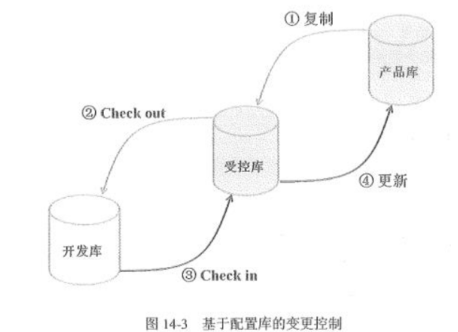
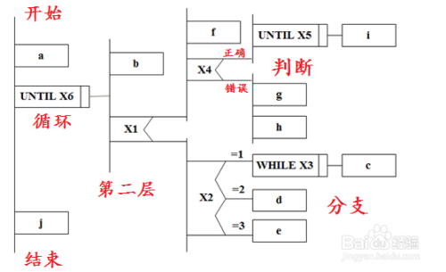
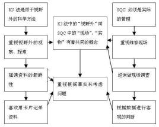
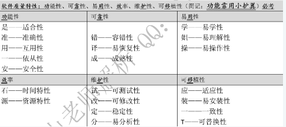
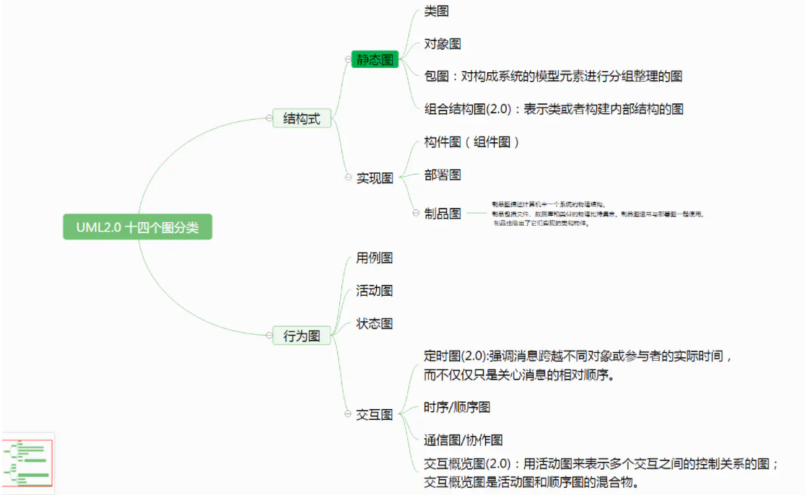
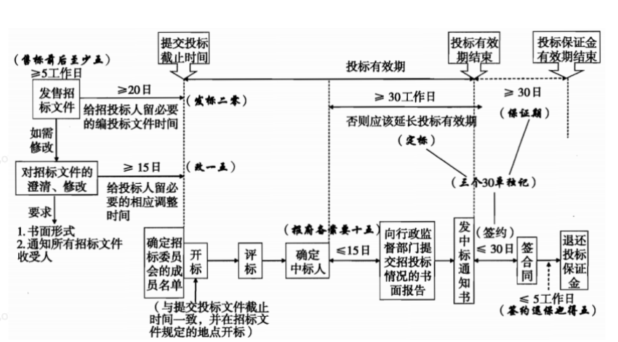

# 2019年下

1. 软件需求分析中，（）分别用来表示功能模型和行为模型

A 数据流图，状体转移图B 状态转移图，E-R图C 状态转移图，数据流图D E-R图，状态转移图
> 解析：**选A**
> 数据模型：实体联系图E-R图
> 功能模型：数据流图DFD
> ⾏为模型：状态转换图STD

2. （）不属于互联网+的特征

A 创新驱动B 资源驱动C 跨界融合D 重塑结构
> 解析：**选B**
> 互联网+的6大特征：跨界融合，创新驱动，重塑结构，尊重人性，开放生态，连接一切

3. 企业在信息化规划过程中，应首先（）

A 制定企业信息化战略B 拟定规划方案C 分析企业信息化现状D 总体架构设计
> 解析：**选C**
> 企业信息系统规划的主要步骤：
> 1. 分析企业信息化现状
> 1. 制定企业信息化战略
> 1. 信息系统规划方案拟定
> 1. 总体结构设计

4. 项目可行性研究中，开发总成本一般不包括（）

A 行政管理费B 销售和分摊费用C 财务费用折旧D 运行维护费用
> 解析：**选D**
> 开发总成本一般划分为四大类：**研发成本、行政管理费、销售与分销费用**、财务费用和折旧。前三类成本的总和称为经营成本。开发成本在项目可行性研究中的用途为计算盈亏，计算净周转资金的需要量，并用于财务评价。

5. 在项目管理中，确认范围的输入不包括（）

A 项目管理计划B 工作绩效数据C 验收可交付成果D 需求跟踪矩阵
> 解析：**选C**
> 范围确认的输入：项目管理计划，需求文件，需求跟踪矩阵，**核实的可交付成果**，工作绩效数据

6. 从信息发布的角度看，控制力最强的沟通方式是（）

A 讨论                B 叙述C 征询                D 说明
> 解析：**选B**
> 沟通方式分类：讨论，征询，说明，叙述。**控制力越来越强，参与度越来越低**

7. （）检查并记录风险应对措施在处理已识别风险及其根源方面的有效性，以及风险管理过程的有效性

A 风险再评估B 风险审计C 偏差和趋势分析D 技术绩效测量
> 解析：**选B**
> **风险审计**的定义就是这句话

8. （）能让项目经理和项目团队洞察成员的优势和劣势

A 人际关系技能B 项目绩效评估C 人事测评D 冲突管理
> 解析：**选C**
> 人事测评可以帮助项目经理评估成员的偏好和愿望，成员如何处理和整理信息，如何制定决策，以及如何与人打交道。

9. 发现待修改的问题，程序员需要将待修改代码从（）取出放入（），其次检出代码放入（），修改完成被放入受控库后，才能被其他程序员检出

A 产品库、开发库、受控库B 受控库、开发库、产品库C 受控库、产品库、开发库D 产品库、受控库、开发库
> 解析：**选D**
> 

10. （）不属于建立战略合作伙伴关系的目的

A 加快资金周转B 降低管理费用C 共享企业资质D 提高管理水平
> 解析：**选C**
> 伙伴关系的意义：
> 1. 提高供应灵活性
> 1. 降低管理费用、加快资金周转
> 1. 提高采购设备的质量
> 1. 加强与供应商沟通
> 1. 加快产品开发速度
> 1. 提高管理水平

11. 在CPIF合同中，A是卖方，B是买方，合同的实际成本大于目标成本。A得到的付款总数是（）

A 目标成本+目标费用-B应承担的成本超支B 目标成本+目标费用+A应承担的成本超支C 目标成本+目标费用-A应承担的成本超支D 目标成本+目标费用+B应承担的成本超支
> 解析：**选D**
> 在CPIF合同中：
> - 实际成本>目标成本，付款总数=目标成本+目标费用+买方应承担的成本超支
> - 实际成本<目标成本，付款总数=目标成本+目标费用-买方应享受的成本节约

12. 项目组合管理的描述，错误的是

A 组合管理绩效必须结合战略目标进行测量B 组合管理使组织在高速发展和快速变化的环境中维持市场竞争力C 组合管理统筹财务、人力、设备等资源D 项目绩使组织战略计划和项目组合之间联系的桥梁
> 解析：**选D**
> 项目集和项目没有必然的联系

13. 实施组合管理的步骤包括（），1 为组合管理定义角色和职责；2 沟通组合管理实施计划；3 定义和部署详细的组合管理过程；4 为参与人员和干系人提供培训；5 执行组合管理监督，确保与组织战略目标一致

A 1，2，3，4B 1，3，4，5C 1，2，4，5D 2，3，4，5
> 解析：**选A**
> 主要步骤有没有第5步

14. （）的目标使防止内部机密或敏感信息非法泄露和资产流失

A 数字证书B 安全审计C 入侵检测D 访问控制
> 解析：**选B**
> 安全审计包括两方面：
> - 采用网络监测和入侵防范，识别网络违规操作
> - 对信息内容和流程进行审计，防止内部敏感机密信息的泄漏

15. （）在军事和安全部门应用最多

A 自主访问DACB 强制访问MACC 访问控制列表ACLD 基于角色的访问控制PBAC
> 解析：**选B**
> - DAC，针对每个用户指明可以访问的信息
> - ACL，**应用最多**，指明哪些用户可以访问；列表外的用户不能访问
> - MAC，**军事和安全部门应用多**，目标有一个安全等级标签
> - RBAC，针对组织内的角色分配相应的权限

# 2019年上

1. ()将哪些无法直接追溯到特定项目的成本计算出来，因此将通过一些经过批准和记录的会计程序来公平的累积和分配多个项目成本

A 直接成本B 运营成本C 间接费用D 实施成本
> 解析：**选C**

2. GB/T14394-2008 用于知道软件产品生存周期可靠性和（）大纲的制定和实施

A 可用性B 可维护性C 可访问性D 可移植性
> 解析：**选B**
> GB/T14394-2008 全称：**计算机软件可靠性和可维护性管理**

3. 关于web安全和防护技术，错误的是

A 当前账户的主要威胁有可现任站点的流动、浏览器和产经漏洞、网络钓鱼、僵尸网络等B web防篡改技术有单点登录、时间轮询、事件触发C web内容安全技术有电子邮件过滤、网页过滤、反间谍技术D web访问控制的主要任务是保证网络资源不被非法访问者访问
> 解析：**选B**
> - web访问控制技术：⽤户名、⽤户⼝令识别与验证
> - 单点登录：⼀点登录，多点访问
> - ⽹⻚防篡改技术
>    - 时间轮询
>    - 核⼼内嵌
>    - 事件触发
>    - ⽂件过滤驱动
> - web内容安全
>    - 电⼦邮件过滤
>    - ⽹⻚过滤
>    - 反间谍软件

4. 系统规划有很多工具，比如P/O矩阵，R/D矩阵，IPO图，C/U矩阵。其中（）适用于归纳数据

A P/O矩阵B R/D矩阵C IPO图D C/U矩阵
> 解析：**选B**
> **R/D矩阵是用于归纳数据类和企业资源**，通常与功能法配合使用

5. 马洛斯需求层次理论中，位于金字塔第三层的是（）需求

A 安全B 社会交往C 受尊重D 自我实现
> 解析：**选B**
> 马洛斯理论有5层：生理，安全，**社会交往**，受尊重，自我价值实现

6. （）战略组织模式的特点是组织高层从如何动员全体成员参与战略实施活动的角度考虑战略的制定和执行。

A 变革型B 合作型C 文化型D 增长型
> 解析：**选C**
> 组织战略报考**战略类型**和**组织类型**的分类，其中
> 战略类型分为：
> - **防御者战略：产品线窄，领导也不积极扩展领域**
> - **探索者战略：发掘新产品、新市场**
> - **分析者战略：在规避风险的同时，提供创新产品**
> - **反应者战略：内忧外患，对外缺乏竞争力，对内缺乏内部控制机制**
> 
组织类型分为：
> - **指挥型：高层制定战略，下面人执行并反馈报告**
> - **变革型：如何实施组织战略为主题，高层+帮手**
> - **合作型：最高层+其他高层人员**
> - **文化型：建立全体成员参与组织战略的文化基础**
> - **增长型：如何激励管理人员的积极性和主动性为主题**

7. （）是一种支持结构化设计的流程设计工具。他的执行顺序是从最左主干的上端节点开始，自上而下依次执行

A 因果分析图B 亲和图C 问题分析图D 判定图
> 解析：**选C**
> - **问题分析图**：又叫PAD图，控制流程为自上而下,从左到右地执行.样式如下：
> 

> - 因果图：又叫**鱼骨图**，是鱼刺样式：
> - **亲和图**：将处于混乱状态中的语言文字资料，利用其**内在相互关系 (亲和性)** 加以归纳整理，然后找出解决问题新途径的方法
> 

> - 判定图：

8. （）可用于评估项目内项目组合管理成熟度，用于识别组织目前最佳实践能力和结果

A TQMB EFQMC OPM3D PMBOK
> 解析：**选C**
> - TQM：全面质量管理
> - EFQM：业务卓越模型，是欧洲使用最广的质量管理架构
> - OPM3：组织项目管理成熟度模型，用于评估成熟度
> - PMBOK：项目管理知识体系，PMI协会对项目管理所需的知识、技能和工具进行的概括性描述，**不是一个标准**

9. （）属于系统测试执行过程中工作效率的指标

A 进度偏离度B 需求覆盖率C 评审问题数D 有效缺陷率
> 解析：选A
> - 进度偏离度：测试执行的效率，还有**执行效率，缺陷发现率**
> - 需求覆盖率：测试设计的效率
> - 评审问题数：测试设计的质量指标
> - 有效缺陷率：测试执行的质量指标

# 2018年下

1. 软件质量模型描述了软件产品的质量特性和质量子特性。其中（）包括适宜性、准确性、互用性、依从性和安全性等子特性

A 功能性        B 可靠性        C 可用性        D 可维护性
> 解析：选A
> 

2. 计算机系统分为5个安全保护等级，其中（）适用于中央级国家机关、广播电视部门重要物资储备单位等部门

A 系统审计保护级B 安全标记保护级C 结构化保护级D 访问验证保护级
> 解析：选C
> 1. 用户自主保护级：普通内网户
> 1. 系统审计保护级：商务活动，非重要单位
> 1. 安全标记保护级：地方各级机关、大型工商企业
> 1. 结构化保护级：中央级机关、**重要物资储备单位**
> 1. 访问验证保护级：国防关键部门和特殊隔离单位

3. 项目管理计划不包括（）

A 绩效信息B 项目目标C 配置管理计划D 生命周期模型
> 解析：选A
> 项目管理计划记录了**规划过程组**中的各个计划子过程的全部成果。绩效信息明显不属于规划过程组。

4. 项目风险的描述，不正确的是（）

A 纯粹风险和人为风险在一定条件下可以相互转化B 项目风险既包括对目标的威胁，也包括促进项目目标的机会C 风险大多数随着项目的进展而不断变化，不确定性回逐渐减小D 风险后果包括发生的频率、收益或损失大小
> 解析：选A
> 纯粹风险和**投机风险**在一定条件下可以相互转化

5. （）不属于人力资源管理的范畴

A 人员获取和能力匹配B 建立项目组织计划C 企业人员入职培训D 有效利用冲突和竞争
> 解析：选B
> 人力资源管理过程包括：规划人力资源，组建项目团队，建设项目团队，管理项目团队。

6. 管理项目团队的输入包括（）1 成员清单 2 人力资源管理计划 3 问题日志 4 组织过程资产 5 变更请求 6 组织绩效评价

A 1234B 1345C 1245D 2456
> 解析：选A
> 变更请求是输出，管理的过程中可能出现变更。

# 2018年上

1. A公司根据系统设计任务书规定的范围，确定系统的基本目标和逻辑功能要求，提出新系统的逻辑模型，着属于信息系统生命周期（）阶段的工作。

A 系统规划B 系统分析C 系统设计D 系统实施
> 解析：选B
> - 系统规划：确定系统发展战略，对需求做出分析和预测，约束，可行性研究
> - 系统分析：做什么，确定新系统基本目标和逻辑功能要求，提出逻辑模型
> - 系统设计：详细架构设计，怎么做
> - 系统实施：设备安装采购，人员培训，编码，调试，测试，实施进展报告
> - 系统运行和维护阶段：维护和评价，评价工作质量和经济效益

2. 某云计算服务商向电信运营商提供计算能力、存储空间和相应的管理服务。这服务类型属于（）

A IaaSB CaaSC PaaSD SaaS
> 解析：选A
> - IaaS基础设施即服务：硬件、计算能⼒、存储空间
> - PaaS平台即服务：虚拟的操作系统、数据库管理系统、web应⽤
> - SaaS软件即服务：应⽤软件、组件、⼯作流等虚拟化软件

3. 由某人、某小组或借助某种工具对源代码进行的独立的审查，以验证其是否符合软件设计文件和程序设计标准，称为（）

A 桌面检查B 代码评审C 代码走查D 代码审计
> 解析：选D
> - 审计：验证是否符合软件设计文件和程序设计标准
> - 走查：静态分析，对设计或编码是否违背开发标准，可能存在错误等当面进行评价
> - 检查：对程序执行情况进行人工模拟，逐步检查代码是否有错误

4. （）不属于可开心质量特性

A 安全性        B 成熟性        C 容错性        D 可恢复性
> 解析：选A
> 6个质量特性，21个子特性见18年下中的图表

5. 设备的（）是指设备在一定时间内不出故障的概率

A 完整性        B 稳定性        C 可靠性        D 保密性
> 解析：选B
> - 稳定性：设备在一定时间内不出故障
> - 可靠性：设备在一定时间内正常执行任务的概率
> - 可用性：设备随时可以正常使用的概率

6. 在OSI网络模型中，（）的主要作用是将网络地址转换为对应的物理地址，并决定将数据从发送方送达接收方

A 数据链路层B 物理层C 网络层D 传输层
> 解析：选C
> 网络层IP，负责将网络地址（**有IP地址肯定网络层**）翻译成物理地址

7. 项目管理计划的内容不包括（）

A 沟通管理计划B 选择的生命周期模型C 资源日历D 成本基准
> 解析：选C
> 资源日历按新教材来说是明显的项目文件，不是项目管理计划

8. （）方法是根据赣西特主动参与项目的程度和改变项目计划或执行的能力进行分组

A 权力、利益方格B 权力、影响方格C 影响、作用方格D 凸显模型
> 解析：选C
> - **权力、利益方格：干系人的职权大小和对项目的关注程度**
> - **权力、影响方格：干系人职权大小和主动参与的程度**
> - **影响、作用方格：主动参与程度和改变计划、执行的能力**
> - **凸显模型：干系人的权力、紧迫程度和合法性**

9. A 公司承接了某网系统的建设项目，包括应用软件开发、软硬件集成适配、系统运维等。对于该项目，不正确的是

A 干系人包括客户、公司高层、项目成员和网上用户B 干系人管理工作应由该项目成员分工负责C 干系人管理有助于项目赢得更多的资源D 干系人对项目的影响能力在项目启动阶段最大，随着项目的进展逐渐减弱
> 解析：选B
> 干系人管理应由项目经理负责，成员需要参与，但不是负责。

10. （）不属于风险识别的依据

A 成本管理计划B 范围基准C 采购文件D 风险类型
> 解析：选D
> 风险类型明显是风险识别之后的分类，是输出，不是依据

11. 项目组合管理实施的主要过程不包括（）

A 评估项目组合管理战略计划B 定义项目组合管理的愿景和计划C 实施项目组合管理过程D 改进项目组合管理过程
> 解析：选A
> 项目组合管理实施的主要过程有：
> - 评估项目组合管理的当前状态
> - 定义项目组合管理的愿景和计划
> - 实施项目组合管理过程
> - 改进项目组合管理过程

12. （）是一种统计方法，用于识别哪些因素会对正在生产的产品或流程的特定变量产生影响

A 过程分析B 实验设计C 标杆对照D 质量审计
> 解析：选B
> 注意题干，特定变量的影响，只有实验设计可以针对某个变量

# 2017年下

1. 研究软件架构的根本目的是解决软件的服用、质量和维护问题。在这一活动宏，架构评估人员关注的是系统的（）属性

A 功能        B 性能        C 质量        D 安全
> 解析：选C
> 架构评估，关注的是**质量属性**

2. 根据GB/T 16260.1-2006，可以将软件质量划分为（）个特性

A 3        B 4        C 5        D 6
> 解析：选D
> 6个质量特性和21个子特性，以最小重叠描述了软件质量

3. “信息系统被破坏，对社会秩序和公共利益造成严重损害，或对国家安全造成损害”是（）的特征

A 第二级        B 第三级        C 第四级        D 第五级
> 解析：选B
> - 第⼀级：个⼈合法利益遭到损害
> - 第⼆级：个⼈合法利益严重损害，社会利益损害
> - 第三极：公共利益严重损害，国家安全利益损害
> - 第四级：公共利益特别严重损害，国家安全利益严重损害
> - 第五级：国家安全利益特别严重损害

4. 网络设计中，（）主要目的是网络访问控制、数据包处理、过滤、寻址和其他数据处理任务

A 接入层B 汇聚层C 主干层D 核心层
> 解析：选B
> - 汇聚层：核⼼层和接⼊层的分界⾯，负责⽹络访问策略控制、数据包处理、过滤、寻址，其他数据处理核⼼层：⾼速转发通信，提供优化可靠的⻣⼲传输结构接⼊层：允许终端⽤户连接当⽹络

5. UML2.0一共有14种图，其中（）属于交互图

A 类图        B 定时图        C 状态图        D 对象图
> 解析：选B
> 

6. 招标人和中标人应该在中标通知书发出之日（）天内，按照招标文件和投标文件订立书面合同

A 30        B 20        C 15        D 10
> 解析：选A
> 

7. （）不属于项目监控工作的成果

A 进度预测B 项目文件更新C 工作绩效报告D 项目管理计划更新
> 解析：选A
> 进度预测属于监控项目的输入

8. 团队成员相互依靠，平稳高效地解决问题，成员的集体荣誉感非常强是属于（）的特征

A 形成阶段B 震荡阶段C 规范阶段D 发挥阶段
> 解析：选D
> 1. 形成阶段：个体转变为团队成员，开始形成共同⽬标
> 1. 震荡阶段：遇到困难，个体之间相互争执、相互指责
> 1. 规范阶段：⼀段时间磨合，成员开始协同⼯作，相互信任
> 1. **发挥阶段：集体荣誉感⾮常强**
> 1. 解散阶段：项⽬结束，团队解散

9. （）是由于他人对你的认可和敬佩从而愿意啊模仿和服从你，希望自己成为你一样的人而产生的人格魅力

A 职位权力B 奖励权力C 专家权力D 参照权力
> 解析：选D
> - 专家权⼒：个⼈的专业技能
> - 参照权⼒：成为别⼈学习参照榜样

10. （）通过设定优先级并提供必要的资源的方式进行项目选择，保证组织内所有项目都经过风险和收益分析

A 项目组合B 项目集C 项目D 大项目
> 解析：选A
> - 项目组合：有统一的战略目标，需要按照优先级进行排序
> - 项目集：项目之间有一定的关联关系，可以并行不用排序

11. 项目经理张工管理者公司的多个项目，平时工作中，需要不断的与上层领导和其他职能部门进行沟通，通过学习项目管理知识，张工建议公司成立（）进行集中管理

A 组织及质量管理部门B 变更控制委员会C 大项目事业部D 项目管理办公室
> 解析：选D
>  项目管理办公室PMO可以对多个项目进行集中管理

12. 战略管理包含3个层次，（）不属于战略管理

A 目标层B 规划层C 方针层D 行为层
> 解析：选B
> 战略管理有两种分类：
> - 目标层、方针层、行为层
> - 组织层、事业层、职能层

13. （）不属于BPR业务流程重构的原则

A 以流程为中心的原则B 团队管理原则C 以客户为导向的原则D 风险最小化原则
> 解析：选D
> - 以流程为中⼼
> - 团队管理
> - 以客户为导向

14. 过程改进计划详细说明了对项目管理过程和产品开发过程的各个步骤。在项目管理知识领域，过程改进计划产生于（）阶段

A 质量规划B 实施质量保证C 控制质量D 质量改进
> 解析：选A
> 规划质量管理的输出中**有过程改进计划**。另外，四个选项中，既然是改进计划，那肯定是是在规划阶段产生的，所以选Ａ

# 2017年上

1. 创建工作分解结构时，描述生产一个产品所需要的实际部件，组件的分解层次表格称为（）

A 风险分解结构B 物料清单C 组织分解结构D 资源分解结构
> 解析：选B
> - 风险分解结构RBS：按风险类别划分
> - 物料清单BOM：描述部件和组件的分层表格
> - 组织分解结构OBS：执行组织的层次结构
> - 资源分解结构RBS：项目中各类资源

2. （）提供了一种结构化方法使风险识别的过程系统化、全面化，提高组织风险识别的质量。

A 帕累托图B 检查表C 风险类别D 概率影响矩阵
> 解析：C
> 记住吧。**风险类别**，教材原话

3. 一般，项目计划主要关注项目的（），对于大型项目来说，必须优先考虑制定项目的
| A 活动计划B 过程计划C 资源计划D 组织计划 | A 活动计划B 过程计划C 资源计划D 组织计划 |
| --- | --- |

> 解析：A、B
> 项目的计划关注的是**项目活动的计划**。对大型复杂的项目来说，制定活动计划之前，需要优先考虑项目的**过程计划**。教材原文

4. 风险评估不是简单的凭空想象，必须（）后才能方便操作

A 制定风险管理计划B 风险识别C 风险定性分析D 风险定量分析
> 解析：D
> **风险评估不只是简单的凭空想象，必须****进行量化之后****方便操作。**

5. 关于大型复杂项目和多项目管理的叙述中，不正确的是（）

A 大型复杂项目必须建立以过程为基础的管理体系B 为确保大型复杂项目的过程制度起到预期作用，必须在项目团队内部建立统一的体系，包括制定过程、计划过程、执行过程C 大型复杂项目的项目过程确定后，再制定项目计划D 大型IT项目大都是需求不十分清晰的情况下开始的，所以项目分成需求定义和需求实现两个过程
> 解析：B
> 计划过程包括：**制定过程、执行过程、监督过程**。肯定的有监督

**

6. 项目时实现组织（）的一种手段

A 文化        B 战略        C 精神        D 结构
> 解析：B

7. 一下关于需求分析的叙述中，不正确的时（）

A 需求分析的目的是确定系统必须完成的工作，对目标系统提出完整、准确、清晰、具体的要求B 需求分析包括：获取需求、分析需求、编写需求说明三个过程C 需求分析可以有专门的系统分析人员来做，也可以由项目经理带领技术人员完成D 软件需求分为三个层次：业务需求、用户需求，功能需求和分功能需求
> 解析B
> 需求分析分为**需求提出、需求描述和需求评审**三个阶段

8. 软件工程中，（）的目的时评价软件产品，以确定其对使用意图的适合性

A 审计B 技术评审C 功能确认D 质量保证
> 解析：B

9. 软件工程项目中，评估和改进一个过程时提高（）的一种手段，并据此成为提高（）的一种方法
| A 产品质量B 使用质量C 内部质量D 外部质量 | A 产品质量B 使用质量C 内部质量D 外部质量 |
| --- | --- |

> 解析：A、B
> 产品质量，使用质量

10. （）不属于用户文档编制计划内容

A 文档开发过程中实施的质量控制B 用户文档的可用性要求C 确定用户文档需要覆盖的软件产品D 每个文档的媒体和输出格式的控制模板和标准设计
> 解析：A
> 质量控制不属于编制文档计划的内容，属于质量管理

11. 安全审计的主要作用不包括（）

A 对潜在的供给者起到震慑或警告作用B 对已发生的系统破坏行为提供有效追究证据C 通过提供日志，帮助系统管理员发现入侵行为获取安在漏洞D 通过性能测试，帮助系统管理员发现性能缺陷
> 解析：D
> 安全审计**4大作用**，是ABCD中描述的4个，但是D中的**性能缺陷是提供系统运行的统计日志，不是性能测试**。

12. 采用先进成熟的技术和设备，满足当前业务需求，兼顾未来的业务需求，体现了（）设计原则

A 实用性和先进性B 灵活性和可扩展性C 经济学，投资保护D 可管理性
> 解析：A
> 机房设计原则：
> - 实用性和先进性：使用先进成熟的技术，兼顾未来需求
> - 安全可靠性：高可靠的设计和建设，管理机制，预防故障
> - 灵活性和可扩展性：具备支持多种网络传输、多种接口的能力，方便灵活升级
> - 标准化：使用国际国家标准
> - 经济性、投资保护：高效能和高效益
> - 可管理性：全面、完善的机房管理和监控系统

---

